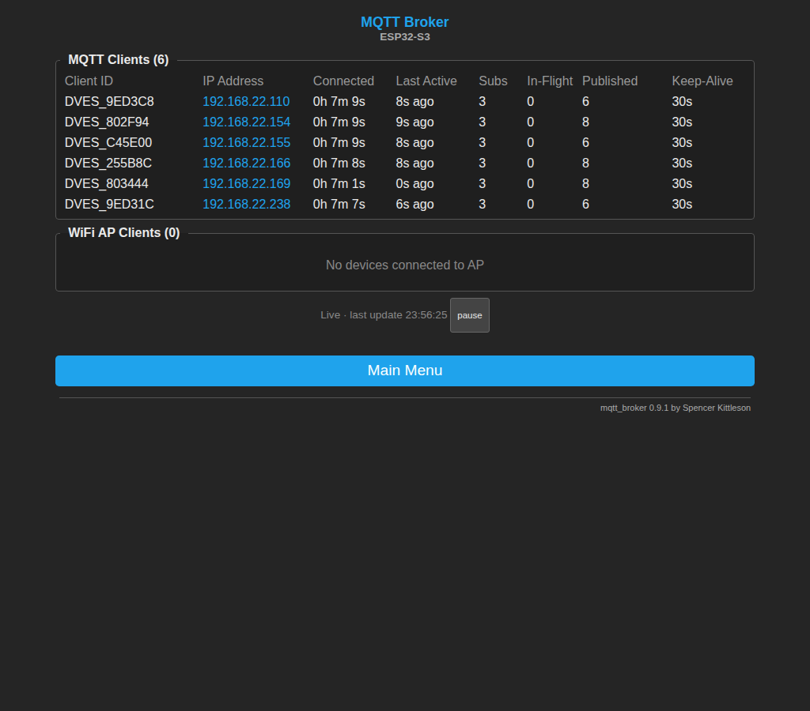
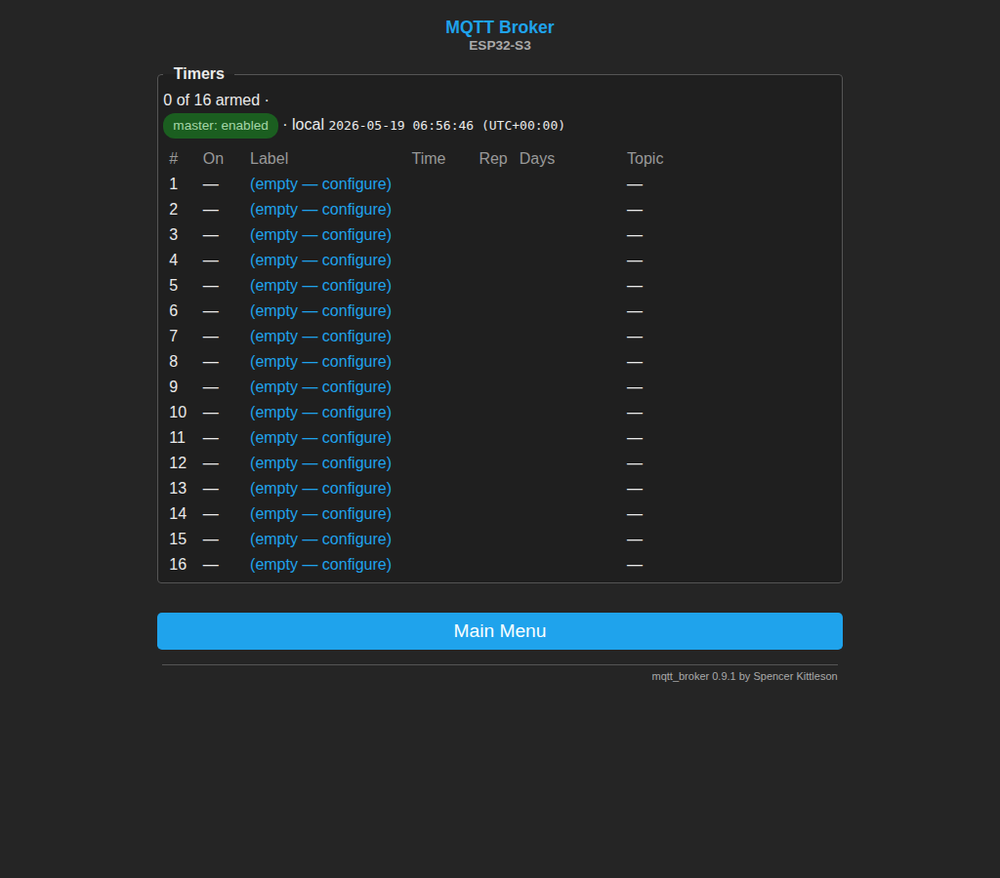

<div align="center">

# ESP32 MQTT Broker

**A standalone MQTT 3.1.1 broker that runs entirely on a $10 microcontroller.**
No cloud. No Pi. No Docker. Plug it in.

[](https://docs.espressif.com/projects/esp-idf/en/latest/esp32s3/get-started/)
[](https://docs.oasis-open.org/mqtt/mqtt/v3.1.1/os/mqtt-v3.1.1-os.html)


[](LICENSE)
[](https://github.com/skittleson/mqtt_broker_esp/stargazers)

[Quick start](#quick-start) · [Features](#features) · [Docs](#documentation) · [Building](#building-from-source) · [Testing](#testing)

<a href="docs/SCREENSHOTS.md"></a>

<sub><a href="docs/SCREENSHOTS.md">Full portal tour →</a></sub>

</div>

---

Most MQTT setups need a Raspberry Pi, a cloud account, or a Linux box running
Mosquitto. This puts the **entire broker on an ESP32-S3**: 100 concurrent
clients, QoS 0/1, retained messages, OTA updates, a Tasmota-style web portal,
**scheduled publishes**, **Berry scripting**, and an SNTP server — all on
an 8 MB chip you can power from a USB battery.

Built for home automation, IoT sensor fleets, and edge deployments that need a
local broker with zero maintenance.

## Quick start

```bash
# Build & flash (requires ESP-IDF v5.5+)
source $IDF_PATH/export.sh
git clone https://github.com/skittleson/mqtt_broker_esp.git
cd mqtt_broker_esp
idf.py build flash monitor
```

On first boot the device comes up as a WiFi AP:

1. Connect to **`mqtt-broker`** (password `mqtt1234`)
2. Open <http://192.168.25.1>, enter your WiFi credentials
3. After reboot it joins your network and starts the broker on port **1883**
4. Discover it: `avahi-browse -rt _mqtt._tcp` → it advertises as `mqtt_broker.local`

```bash
mosquitto_sub -h mqtt_broker.local -t "test/#" -v &
mosquitto_pub -h mqtt_broker.local -t "test/hello" -m "world"
```

Schedule a Tasmota-style publish without leaving the broker:

```bash
# Set your timezone on /settings first (dropdown of ~40 presets)
curl -u user:pass http://mqtt_broker.local/settings   # → Time (NTP) → pick a preset

# Then arm slot 1 to publish at 17:00 every weekday
TOKEN=$(curl -s -u user:pass http://mqtt_broker.local/api/csrf | jq -r .token)
curl -u user:pass -H "X-CSRF-Token: $TOKEN" -H 'Content-Type: application/json' \
     -X PUT http://mqtt_broker.local/api/timers/1 \
     -d '{"a":1,"r":1,"hm":1020,"d":"-MTWTF-","tp":"cmnd/tasmotas/POWER","pl":"ON","l":"lights on"}'
# → {"saved":true,"n":1,"next_fire_unix":...}
```

## Features

- **Full MQTT 3.1.1** — CONNECT, SUBSCRIBE, PUBLISH, PUBACK, UNSUBSCRIBE, PINGREQ, DISCONNECT
- **QoS 0 and QoS 1** in both directions, with in-flight retry tables and `min(pub, granted)` delivery
- **100 concurrent clients**, 2,048 subscriptions, 16 KB payloads (binary-safe up to 64 KB retained)
- **Retained messages** with configurable TTL, PSRAM-backed, FIFO eviction at 80% PSRAM
- **Wildcards** — `+`, `#`, and `$SYS` topic protection per spec §4.7
- **Authentication** — optional MQTT username/password + Basic Auth on the portal
- **Web portal** — Tasmota-style dark UI: dashboard, live `/clients`, settings, OTA, firmware rollback
- **Scheduled publishes** — 16 Tasmota-style timer slots (Arm / Repeat / HH:MM local / day mask / window jitter / publish topic+payload+QoS+retain). DST-aware via POSIX TZ (preset dropdown for ~40 common zones). Persists in NVS. Per-slot test-fire and master pause.
- **OTA updates** — file upload, URL fetch, dual partitions, manual rollback button
- **Built-in NTP** — SNTP client + SNTPv4 server on UDP :123, mDNS `_ntp._udp` advertisement, <±50 ms drift, drift compensation while free-running
- **Ethernet gateway mode** (optional) — W5500 SPI + NAPT to bridge an isolated IoT WiFi to your LAN
- **mDNS** — reachable as `<hostname>.local`, advertises `_mqtt._tcp`, `_http._tcp`, `_ntp._udp`
- **WS2812 status LED** — visual boot/connect/run/AP state
- **No external MQTT library** — single C codebase, the only non-IDF dep is `espressif/led_strip`
- **Berry scripting** — embedded Berry v1.1.0 VM on CPU 1 (see below)

<details>
<summary>Use cases</summary>

- **Home automation hub** — local MQTT for Zigbee/Z-Wave bridges, ESPHome, Home Assistant
- **Scheduling without a hub** — "lights on at 17:00 weekdays" publishes `cmnd/tasmotas/POWER=ON` directly from the broker; no Node-RED, no Home Assistant, no cron job on a Pi
- **Mobile / field** — USB battery + ESP32 = portable MQTT infra for trade shows, ag, testing
- **Network isolation** — Ethernet build bridges a 2.4 GHz IoT WiFi to your LAN with togglable NAPT
- **Client tracking** — `/api/clients` exposes every connected device for dashboards/alerts

</details>

## Hardware

| Component | Spec                                                                                               |
| --------- | -------------------------------------------------------------------------------------------------- |
| Board     | [Waveshare ESP32-S3-ETH](https://www.waveshare.com/wiki/ESP32-S3-ETH) (or any ESP32-S3 with PSRAM) |
| MCU       | ESP32-S3 dual-core Xtensa LX7 @ 240 MHz                                                            |
| PSRAM     | 8 MB octal SPI                                                                                     |
| Flash     | 16 MB (dual 4 MB OTA partitions)                                                                   |
| WiFi      | 802.11 b/g/n 2.4 GHz                                                                               |
| LED       | WS2812 on GPIO21                                                                                   |
| Console   | USB-Serial/JTAG                                                                                    |

Any ESP32-S3 board with PSRAM works. The W5500 on the Waveshare board is only
needed for [Ethernet gateway mode](docs/architecture.md#ethernet-gateway-w5500).

## Web portal

<p align="center">
  
  &nbsp;
  
</p>

<sub align="center"><a href="docs/SCREENSHOTS.md">→ Full portal tour with desktop + mobile screenshots of every page</a></sub>

- **`/`** — dashboard with WiFi/broker stats, MQTT auth state, device info
- **`/clients`** — live MQTT clients (ID, IP, uptime, subs, in-flight, published, keepalive) + WiFi AP clients (MAC, RSSI). Polls `/api/clients` every 3 s, pause button, tab-hidden backoff
- **`/timers`** — 16 scheduled-publish slots. List view shows armed state (● / ◐ / —), repeat icon, time, day mask, topic. Edit form has Tasmota-parity fields (Arm / Repeat / Time / Window / Days / Topic / Payload / QoS / Retain) plus a live `Next fire: today at 17:00 (in 4h 12m)` line. Master pause pill in the header. Mobile collapses to stacked cards below 600 px
- **`/settings`** — broker port, auth, buffer size, retain, AP credentials, hostname, NAPT, NTP, **timezone dropdown** (~40 IANA presets + free-form POSIX TZ). **Save & Reboot** with confirm dialog and countdown page
- **`/update`** — file upload, URL fetch, rollback button showing the other partition's version
- **`/time`** — live clock, NTP client+server status, recent SNTP clients, force-resync
- **`/berry`** — Berry scripting manager (see [Berry scripting](#berry-scripting) below)
- **JSON API** — `/api/status`, `/api/clients`, `/api/time`, `/api/timers` (GET list, PUT/DELETE per slot — CSRF-protected), `/api/ping` (open, for liveness), `/api/berry/status`, `/api/berry/log`

Full endpoint and JSON reference: [`docs/api.md`](docs/api.md).

## Berry scripting

The broker embeds **Berry v1.1.0** as a lightweight automation layer.
Scripts run on a dedicated FreeRTOS task (CPU 1) and never block the
broker's select() loop.

**`/berry`** — 4 named script slots, each with a label, enable toggle, and
up to 2,000 bytes of Berry code. Enabled slots run in order on every
boot/restart. Edit inline, run one-off snippets in the REPL pane.

### Available modules

```berry
# Subscribe to MQTT topics
mqtt.subscribe("sensor/+", def(topic, payload)
  print(topic + " -> " + payload)
end)
mqtt.publish("status/broker", "online")

# Make HTTP requests — returns [status_code, body_string]
import json
var r = http.get("http://192.168.1.100/api/status")
if r[0] == 200
  var obj = json.load(r[1])       # parse JSON body
  print(str(obj["power"]))
end

var r2 = http.post("http://host/webhook", "payload text")
print(r2[1])                      # plain text response as-is
```

**Supported response formats:** JSON (`json.load(r[1])`) or plain text
(`r[1]` as-is). Status `-1` with an error description on network failure.

See [`examples/berry/`](examples/berry/) for copy-paste-ready scripts and
the full API quick-reference.

## Configuration

All settings persist to NVS and survive reboots.

| Setting           | Default                    | Notes                                                                             |
| ----------------- | -------------------------- | --------------------------------------------------------------------------------- |
| MQTT port         | 1883                       | 1–65535, takes effect after reboot                                                |
| Auth user/pass    | _(empty)_                  | Empty = open broker                                                               |
| Buffer size       | 16,384                     | 1,024–65,536, per-client recv + shared send                                       |
| Retain enable     | on                         | Off rejects all retain flags                                                      |
| Retain TTL        | 168 h                      | 0 = never expire                                                                  |
| AP SSID / pass    | `mqtt-broker` / `mqtt1234` | WPA2-PSK                                                                          |
| AP IP             | `192.168.25.1`             | Also compile-time                                                                 |
| Hostname          | `mqtt_broker`              | DHCP + mDNS (`<hostname>.local`)                                                  |
| NAPT              | on                         | Ethernet builds only, toggles live                                                |
| NTP client/server | on / on                    | Up to 3 upstreams, configurable poll interval                                     |
| Timezone          | `UTC0`                     | POSIX TZ string (preset dropdown + free-form input); DST handled by `localtime_r` |
| Timers            | _(empty)_                  | 16 slots in NVS “mqtt_cfg”/“timers”, JSON blob (schema `v=1`)                     |

Compile-time tunables (max clients, in-flight slots, retry timing, LED GPIO,
SPI pins, …) live in `main/mqtt_broker.h`, `main/Kconfig.projbuild`, and
`sdkconfig.defaults`. See [docs/architecture.md](docs/architecture.md#scaling-the-client-limit)
for scaling past 100 clients.

## Building from source

```bash
# ESP-IDF v5.5+: https://docs.espressif.com/projects/esp-idf/en/latest/esp32s3/get-started/
source $IDF_PATH/export.sh

idf.py build              # build
idf.py flash monitor      # flash + serial log
idf.py menuconfig         # tweak: "MQTT Broker Configuration"
```

For the Ethernet gateway build (W5500 + NAPT):

```bash
cat sdkconfig.defaults sdkconfig.defaults.eth > sdkconfig.combined
idf.py -D SDKCONFIG_DEFAULTS="sdkconfig.combined" reconfigure
idf.py build
```

## Testing

The test suite runs against a **live broker** (there is no host-build today —
tests target the real radio + Ethernet stack on a flashed device).

```bash
pip install paho-mqtt requests ntplib jsonschema

# Everything (MQTT + NTP), default host 192.168.22.100
make test

# Targeted
BROKER_HOST=192.168.1.100 make test-broker        # 116 MQTT/portal tests
BROKER_HOST=192.168.1.100 make test-ntp           # 13 NTP tests

# With portal auth
BROKER_AUTH=admin:secret make test

# Destructive cycle (saves settings, reboots 2-3×, ~2 min extra)
BROKER_TEST_DESTRUCTIVE=1 make test

# Stress: 90 concurrent connections, 500-msg throughput, 255 topics
python3 stress_test.py
```

**~129 assertions** cover: protocol conformance, wildcards, retained, binary
payloads up to 15 KB with MD5 verification, 50-client concurrency, throughput,
latency, duplicate client IDs, keep-alive, QoS-1 inbound + outbound, unsubscribe,
all portal pages and JSON APIs, settings persistence, NTP client+server, mDNS
discovery, anti-amplification, and rate-limit drops.

## Documentation

- [`docs/architecture.md`](docs/architecture.md) — tasks, cores, memory layout, flash partitions, QoS internals, Ethernet/NAPT, LED states, network modes, scaling past 100 clients
- [`docs/api.md`](docs/api.md) — all HTTP endpoints, JSON schemas, `$SYS` topics, curl examples
- [`docs/SCREENSHOTS.md`](docs/SCREENSHOTS.md) — annotated portal tour (desktop + mobile) for every page
- [`plan-scheduled-publishes.md`](plan-scheduled-publishes.md) — timers design, DST/TZ correctness analysis, 10-year-lifetime rationale
- [`docs/timers-ux-audit-v0.8.0.md`](docs/timers-ux-audit-v0.8.0.md) — portal UX audit methodology, baseline screenshots, fix sequencing
- [`docs/portal-latency-analysis.md`](docs/portal-latency-analysis.md) — measurements behind the 0.6.6 latency work
- [`docs/qos-persistence-plan.md`](docs/qos-persistence-plan.md) — roadmap for persistent sessions
- [`CHANGELOG.md`](CHANGELOG.md) — per-release notes (full text under [`changelog/`](changelog/))

## Roadmap

- QoS 2
- Persistent sessions in PSRAM (no per-message flash writes — 10-year device-life goal)
- TLS / certificate auth
- Sunrise/sunset modes on timers (needs lat/lon settings first)
- `cmnd/<host>/Timer<n>` Tasmota MQTT command bridge (configure timers from Tasmoadmin etc.)
- Mobile card layout pattern applied to `/clients`
- Bootloader auto-rollback with an in-app self-test
- Auto-regenerate `tz_presets.c` from current IANA tzdata in CI

## Contributing

PRs welcome. Workflow:

1. Fork & branch (`git checkout -b feature/x`)
2. Build (`idf.py build`) and run `make test` against your device
3. Open a PR with the test output

## Acknowledgments

Web portal UX takes cues from the [Tasmota](https://tasmota.github.io/docs/)
project — the dark theme, full-width button menus, fieldset-based info
sections, and Information/Configuration/Firmware Upgrade split. Different
goal (broker, not device firmware), same taste in layout.

## License

[MIT](LICENSE). Custom MQTT implementation — no external broker library. Only
non-IDF dependency is `espressif/led_strip` for the WS2812 status LED.
