<p align="center">
  <h1 align="center">ESP32 MQTT Broker</h1>
  <p align="center">
    A standalone MQTT 3.1.1 broker that runs entirely on an ESP32-S3 microcontroller.
    <br />
    No cloud. No server. Just plug it in.
    <br />
    <br />
    <a href="#quick-start">Quick Start</a>
    &middot;
    <a href="#use-cases">Use Cases</a>
    &middot;
    <a href="#web-portal">Web Portal</a>
    &middot;
    <a href="#configuration">Configuration</a>
    &middot;
    <a href="#testing">Testing</a>
    &middot;
    <a href="#architecture">Architecture</a>
  </p>
</p>

<p align="center">
  
  
  
  
  
  
</p>

---

## What's new in 0.7.0 (NTP support)

The broker is now a complete LAN-local time source. Plan:
[`plan-ntp-server.md`](plan-ntp-server.md). Tagged release —
integration test suite (`make test`) green against the live device on
this build.

- **SNTP client** — `esp_sntp` against up to 3 configurable upstreams
  (defaults: `pool.ntp.org` + `time.cloudflare.com`). Settings persisted
  in NVS namespace `ntp`: enable flag, server-enable flag, upstreams,
  poll interval, POSIX TZ. **Measured drift from `pool.ntp.org`: well
  below ±50 ms** (plan target).
- **SNTP server on UDP :123** — single FreeRTOS task pinned to CPU 0,
  static 48-byte tx buffer, no malloc in the hot path. Drops oversize
  (>68 B) and undersize (<48 B) packets silently (anti-amplification);
  rejects mode=6 / mode=7 (control/private). Per-source rate limit: 10
  req/s, 32-entry LRU. Pre-sync: stratum 16 + LI=3 (alarm) — well-behaved
  clients (chrony, ntpd, w32time, systemd-timesyncd) ignore. Post-sync:
  stratum 3 / LI=0 / `ref_id="ESP3"`. Hand-rolled SNTPv4 client test
  measured **5.6 ms RTT, 0.1 ms server handler latency**.
- **`GET /api/time`** — open (auth-exempt). Returns `{synced, epoch_us,
  last_sync_age_s, sync_count, upstream, server_running, stratum, served,
  dropped: {rate, size, mode}}`. Any LAN client can verify the broker is
  time-synced without credentials.
- **`POST /api/time/resync`** — auth-gated. Forces an immediate upstream
  poll.
- **`$SYS/broker/time`** — non-retained, ASCII epoch seconds, every 10 s.
  **`$SYS/broker/ntp/synced`**, **`/stratum`**, **`/served`** — retained;
  new subscribers see current state on connect.
- **`/time` portal page** — Tasmota-style HTML, server-rendered, no JS in
  the hot path, `<meta http-equiv='refresh' content='10'>` for live
  clock. Sections: big UTC time, client status, server status, Force
  resync button, recent-clients table (sourced from the rate-limit LRU,
  capped at 16 rows). 3.4 KB body.
- **mDNS `_ntp._udp` service advertisement** — substitutes for DHCP
  option 42 (which ESP-IDF's DHCP server doesn't expose for arbitrary
  option codes). Avahi-aware clients (macOS, iOS, ChromeOS, Linux Avahi)
  auto-discover the broker as a time source. Verified live: PTR query
  to `224.0.0.251:5353` -> 120 B response from the device.
- **`Time (NTP)` section in `/settings`** — live sync state, client +
  server enable checkboxes, three upstream slots, poll interval, POSIX
  TZ. Saved through the existing "save = confirm + reboot" flow.
- **Integration test suite** — `test_ntp.py` (13 tests) + `test_broker.py`
  (116 tests) cover the new endpoints, MQTT topics, defensive guards
  (oversize/undersize/bad-mode/rate-limit drops), and mDNS discovery.
  `make test` runs both against any live device.

Not in 0.7.0 (deferred): drift compensation while free-running, manual
`POST /api/time/set` for air-gapped installs, `CONFIG_NTP_BROADCAST`
periodic broadcasts, real DHCP option 42 (needs an IDF lwip patch).

Development iterations [`CHANGELOG-v0.7.0-rc1.md`](CHANGELOG-v0.7.0-rc1.md)
/ [`-rc2.md`](CHANGELOG-v0.7.0-rc2.md) / [`-rc3.md`](CHANGELOG-v0.7.0-rc3.md)
document what shipped per phase.

## What's new in 0.6.6 (portal latency: A + E + F)

Gives the portal the 'dedicated core' property users intuitively expect, kills the 100–250 ms slow tail, and adds runtime visibility into request latency. See [`docs/portal-latency-analysis.md`](docs/portal-latency-analysis.md) for the full analysis and measurements.

- **A. `portal_http`, `portal_dns`, and per-WS tasks pinned to CPU 0** (`xTaskCreatePinnedToCore`). Previously unpinned, often landing on CPU 1 at equal priority to the MQTT broker and round-robining with it on 10 ms tick slices.
- **E. HTTP `listen()` backlog 4 → 8.** Browsers routinely open 6+ parallel connections; the old backlog dropped the 5th and 6th SYNs and the browser took 1–3 s to retry. Now matches the MQTT broker's listen call.
- **F. Per-request access log line** with method, path, and elapsed-ms. Logged at `ESP_LOGW` for slow (≥25 ms) or 401 requests, `ESP_LOGD` (compiled out by default) for fast ones — so the log itself never inflates the metric.

Measured improvement (3 rounds, 30 requests each, live device with 6 connected MQTT clients):

| Metric            | 0.6.4 baseline |      0.6.6 | Delta     |
| ----------------- | -------------: | ---------: | --------- |
| median            |        16.0 ms |    19.5 ms | +3.5 ms   |
| **p95**           |   **129.3 ms** | **~54 ms** | **-58 %** |
| **max**           |   **136.0 ms** | **~70 ms** | **-49 %** |
| requests > 100 ms |           12 % |    **0 %** | **gone**  |

## What's new in 0.6.4

- **`GET /api/ping` (open, auth-exempt) replaces `/api/status` as the reboot-countdown poll endpoint.** Solves a real bug for users running with Basic Auth on: every poll of `/api/status` hit the 401 challenge, browsers dropped cached creds across the network-error -> 401 cycle that occurs during a reboot, and the native auth dialog reopened over and over. `/api/ping` returns only `{"uptime_s":N}` (no settings, no network info, no firmware version), so making it open is safe. `/api/status` and `/api/clients` stay gated.
- **Countdown polling treats _any_ HTTP response as 'device alive'.** The previous logic required a 2xx and rejected on 401/5xx, which would have falsely classified an authenticated endpoint as offline. Now: network error/abort = offline, any received status = alive (with uptime-regression cross-check as a tiebreaker for sub-1s reboots).
- **Subtitle reworded** per user feedback: `Saved. Polling device — will redirect home when it comes back online.` Replaces the older `Settings written. The device is restarting; reconnect in about 10 seconds.`
- **Auto-redirect lowered 800 ms → 400 ms** so the dashboard appears almost instantly after the device returns.
- **`fetch()` polling uses `credentials:'omit'`** as belt-and-braces — even if `/api/ping` were ever moved behind auth by mistake, the browser would still not pop a credential prompt from the countdown page.
- **`tools/capture_*.py` learn `PORTAL_AUTH=user:password`** (env-only, never written to commits or images). Lets the screenshot pipeline keep working against an auth-on portal.

## What's new in 0.6.3

- **Settings save = confirm + reboot + countdown.** `/settings` and `/config` (WiFi credentials) now end with a green `Save & Reboot` button. Submitting fires a browser `confirm()` dialog with the exact wording of what will happen; on OK the server persists every field to NVS, serves the reboot-countdown page (same JS as `GET /reboot` and `POST /ota-rollback`), and restarts. The user lands on the countdown automatically, watches the offline→online transition, and gets dropped on a working dashboard — no more "saved but unclear which settings need a reboot" guesswork.
- **`CMAKE_CONFIGURE_DEPENDS` on `main/version.h`.** Bumping `FW_VERSION` now auto-reruns CMake configure, so the OTA image header's `esp_app_desc_t.version` never silently caches the previous value (previously a `touch CMakeLists.txt` was required).

## What's new in 0.6.2

- **Reboot countdown page** replaces the broken `Rebooting...` dead-end. Whenever the device intentionally goes away (`/reboot`, `/ota-rollback`, OTA upload success, OTA URL success), it returns a standalone page that polls `/api/status` every 1 s, watches for the offline edge so it can't be tricked by a stale in-flight response, and swaps itself for a green `Back online` link the moment the new firmware answers. New read-only `GET /rebooting` endpoint serves the same page without restarting — used by the `/update` upload XHR to redirect users straight to the countdown instead of waiting on a frozen 10-second progress bar.
- **Honest `Other Partition` / Rollback version display.** `PROJECT_VER` is now pulled from `main/version.h` at configure time, so `esp_app_desc_t.version` in the OTA image header matches `FW_VERSION`. The `/update` page no longer shows a confusing git-describe string (`tester-v0.3.0-4-g30c64db-dirty`) on the inactive slot — it shows `0.6.2`, exactly what you'd be rolling back to.

## What's new in 0.6.0 (UX honesty pass)

- **Dashboard now tells the truth.** Single coherent status pill (`Online · Ethernet 192.168.x.x` / `Online · WiFi <ssid>` / `Setup · AP mode @ <ip>`) replaces the old contradictory stack of an orange "AP mode" warning above a green "Ethernet online" badge.
- **No more password leaks.** `/information` and `/settings` no longer render the AP password (or MQTT auth password) in the response HTML. Inputs use `unchanged — leave blank to keep` semantics; an empty submission preserves the stored value, so saving NAPT no longer forces you to retype the AP password.
- **Live `/clients` without the page-reload sledgehammer.** Replaces the destructive `setTimeout(location.reload, 5000)` with in-place `/api/clients` polling every 3 s, a pause button, a `Live · last update HH:MM:SS` indicator, and `visibilitychange`-aware backoff.
- **Firmware rollback button.** `/update` now lists the other OTA partition's version and exposes a `Roll back & Reboot` button (`POST /ota-rollback`). The current image stays in flash, so the same button bounces you back.
- **Tester actually works.** Filter input no longer collapses to a 5 px sliver; payload limit raised 256 → 1024 bytes with a live `N/1024` counter; real MQTT 3.1.1 §4.7 wildcard matching (no more substring-stripping lie); QoS 0/1 selector added next to retain.
- **`/ota-url` accepts `https://`** — previously silently rejected by an HTML5 `pattern` constraint.

Full audit trail with before/after captures: [`CHANGELOG-v0.6.0.md`](CHANGELOG-v0.6.0.md). Roadmap for what's next: [`plan-mqtt-ux-v2.md`](plan-mqtt-ux-v2.md). Regenerate captures from any live device with `PORTAL_URL=http://your.device python3 tools/capture_portal.py`.

## Why?

Most MQTT setups need a Raspberry Pi, a cloud service, or a dedicated server running Mosquitto. This project puts the entire broker on a $10 microcontroller. It connects to your WiFi, starts accepting MQTT clients on port 1883, and runs a Tasmota-style web UI for configuration. No dependencies, no Docker, no Linux.

Built for home automation, IoT sensor networks, and edge deployments where you need a reliable local broker with zero maintenance.

## Use Cases

### Home Automation Hub

Run the broker on your home network alongside Zigbee/Z-Wave bridges, ESPHome devices, and Home Assistant. Every sensor and actuator talks MQTT through a local broker with no cloud dependency. The web portal lets you monitor exactly which devices are connected and what topics they're subscribed to.

### Mobile / Field Deployments

Power the ESP32 from a USB battery pack and take your MQTT infrastructure anywhere. The device creates its own WiFi AP — sensors and controllers connect directly without needing existing network infrastructure. Ideal for trade shows, temporary installations, agricultural monitoring, or testing in the field.

### Network Isolation (2.4 GHz to Ethernet Bridge)

Use the Waveshare ESP32-S3-ETH board to bridge IoT devices on an isolated 2.4 GHz WiFi network to your wired LAN. IoT devices connect to the ESP32's AP, the broker handles messaging, and the Ethernet port connects to your main network. This keeps IoT traffic off your primary WiFi and provides a hardware-level network boundary.

With NAPT enabled, you can still reach every device from your main network — open Tasmota web UIs at `192.168.25.x`, push firmware updates, check sensor readings, or debug misbehaving devices — all from your desk. When you're done, disable NAPT from the portal and the devices go back to being fully isolated. MQTT traffic always flows through the broker regardless of NAPT state.

### Client Tracking and Monitoring

Every connected MQTT client is visible in the web portal with its client ID, IP address, connection duration, subscription count, and keep-alive interval. WiFi AP clients show MAC addresses and signal strength. The `/api/clients` JSON endpoint makes it easy to build dashboards, alerting, or inventory systems that track which devices are online and what they're doing.

## Features

| Category              | Details                                                                                                                                                          |
| --------------------- | ---------------------------------------------------------------------------------------------------------------------------------------------------------------- |
| **Protocol**          | Full MQTT 3.1.1 — CONNECT, SUBSCRIBE, PUBLISH, PUBACK, UNSUBSCRIBE, PINGREQ, DISCONNECT                                                                          |
| **QoS**               | QoS 0 and QoS 1 in both directions. Per-subscriber delivery QoS = min(publisher, granted). QoS 2 not yet implemented (inbound dropped, outbound never selected). |
| **Clients**           | 100 concurrent connections, pre-allocated in PSRAM                                                                                                               |
| **Subscriptions**     | 2,048 total entries across all clients                                                                                                                           |
| **Wildcards**         | `+` (single-level), `#` (multi-level), `$`-topic protection                                                                                                      |
| **Retained Messages** | Configurable TTL (default 7 days), 64KB max per message, PSRAM-backed with FIFO eviction                                                                         |
| **Binary Payloads**   | Up to 16KB per message (configurable buffer size) — supports images, protobuf, etc.                                                                              |
| **Authentication**    | Optional username/password via MQTT CONNECT (CONNACK 0x04 on failure)                                                                                            |
| **Web Portal**        | Tasmota-style dark theme UI for all settings, live stats, and device info                                                                                        |
| **Client Monitoring** | Live view of connected MQTT clients (ID, IP, uptime, subscriptions) and WiFi AP clients (MAC, RSSI)                                                              |
| **Firmware Version**  | Semver display (Tasmota-style) on dashboard, footer, and JSON API                                                                                                |
| **OTA Updates**       | Firmware upload via web UI (file upload) or HTTP URL fetch — dual OTA partitions                                                                                 |
| **JSON API**          | `GET /api/status` returns broker stats, WiFi status, firmware version, and system info                                                                           |
| **WiFi**              | STA + AP mode, NVS credential persistence, automatic AP fallback                                                                                                 |
| **Ethernet**          | Optional W5500 SPI Ethernet with NAPT bridging (compile-time flag)                                                                                               |
| **Captive Portal**    | DNS hijack + HTTP server for WiFi configuration on first boot                                                                                                    |
| **mDNS / Bonjour**    | Configurable hostname; reachable as `<hostname>.local`, advertises `_mqtt._tcp:1883` and `_http._tcp:80`                                                         |
| **LED Status**        | WS2812 on GPIO21 — blue (boot), yellow (connecting), green (running), red (failed)                                                                               |
| **Configuration**     | All settings configurable via web UI, persisted to NVS flash                                                                                                     |

## Hardware

| Component | Spec                                                                                               |
| --------- | -------------------------------------------------------------------------------------------------- |
| Board     | [Waveshare ESP32-S3-ETH](https://www.waveshare.com/wiki/ESP32-S3-ETH) (or any ESP32-S3 with PSRAM) |
| MCU       | ESP32-S3 dual-core Xtensa LX7 @ 240 MHz                                                            |
| PSRAM     | 8 MB octal SPI                                                                                     |
| Flash     | 16 MB (dual 4 MB OTA partitions)                                                                   |
| WiFi      | 802.11 b/g/n 2.4 GHz                                                                               |
| LED       | WS2812 on GPIO21                                                                                   |
| Console   | USB-Serial/JTAG                                                                                    |

> Any ESP32-S3 board with PSRAM should work. The W5500 Ethernet on the Waveshare board is not used by the broker — it connects via WiFi.

## Quick Start

### Prerequisites

- [ESP-IDF v5.5+](https://docs.espressif.com/projects/esp-idf/en/latest/esp32s3/get-started/)
- USB cable to the ESP32-S3

### Build and Flash

```bash
# Set up ESP-IDF environment
source $IDF_PATH/export.sh

# Clone and build
git clone https://github.com/your-username/mqtt_esp32.git
cd mqtt_esp32
idf.py build

# Flash to the device
idf.py flash

# Monitor serial output (optional)
idf.py monitor
```

### First Boot

<p align="center">
  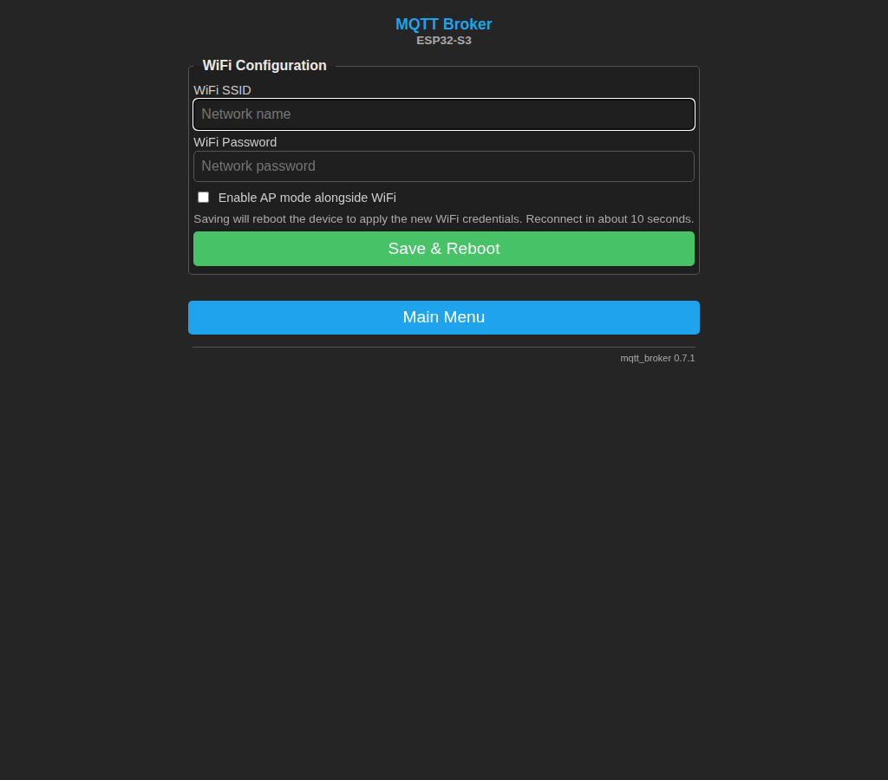
</p>
<p align="center"><em>WiFi configuration captive portal on first boot.</em></p>

1. The device creates a WiFi access point: **`mqtt-broker`** (password: **`mqtt1234`**)
2. Connect to it and open **http://192.168.25.1** in your browser
3. Configure your WiFi credentials in the portal
4. The device reboots, connects to your WiFi, and starts the MQTT broker
5. Connect your MQTT clients to the device's IP on port **1883**

```bash
# Test with mosquitto (by IP, or by mDNS hostname)
mosquitto_sub -h 192.168.x.x      -t "test/#" -v &
mosquitto_sub -h mqtt_broker.local -t "test/#" -v &
mosquitto_pub -h mqtt_broker.local -t "test/hello" -m "world"

# Discover on the LAN via Bonjour/Avahi
avahi-browse -rt _mqtt._tcp
```

The default hostname is `mqtt_broker` and is configurable from the web portal
(`/settings` → Device → Hostname). It is advertised over both DHCP and mDNS, so
the device is reachable as `<hostname>.local` without needing to know its IP.

## Web Portal

The broker includes a Tasmota-style web UI accessible at the device's IP address on port 80.

<!-- Screenshot carousel: GitHub doesn't render JavaScript, so this is a
     static grid + collapsible sections. Click any thumbnail to view full
     size. Captures are regenerated from the live device via
     `make captures` -- see tools/capture_portal.py et al. -->

<table>
  <tr>
    <td align="center" width="33%">
      <a href="docs/screenshots/ux-audit/dashboard_desktop.png">
        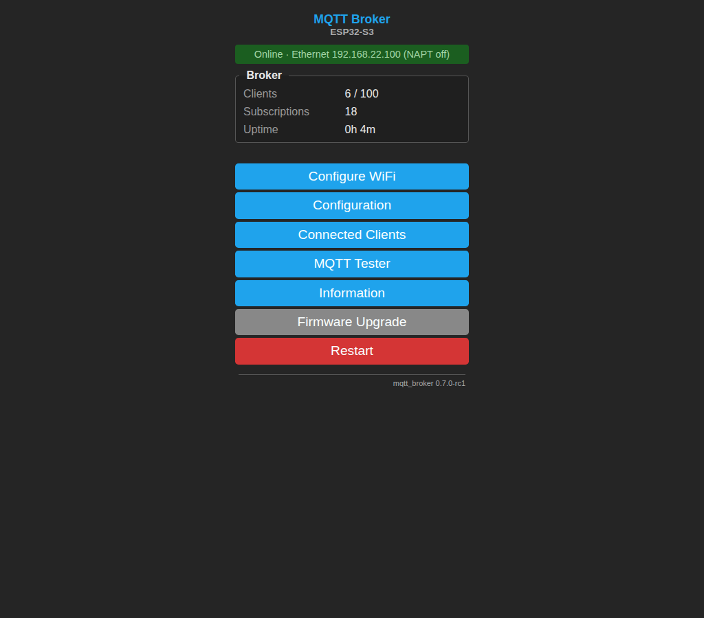
      </a>
      <br/><sub><b>Dashboard</b></sub>
    </td>
    <td align="center" width="33%">
      <a href="docs/screenshots/ux-audit/time_desktop.png">
        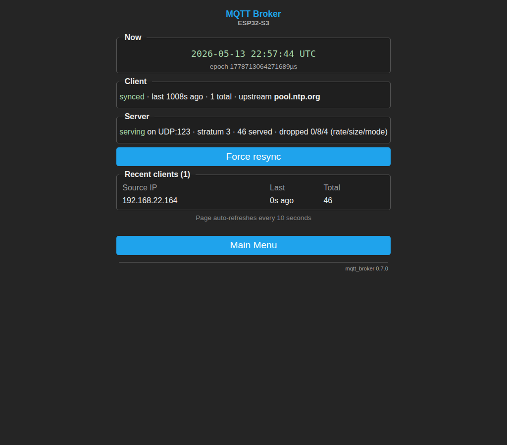
      </a>
      <br/><sub><b>Time / NTP</b></sub>
    </td>
    <td align="center" width="33%">
      <a href="docs/screenshots/ux-audit/settings_desktop.png">
        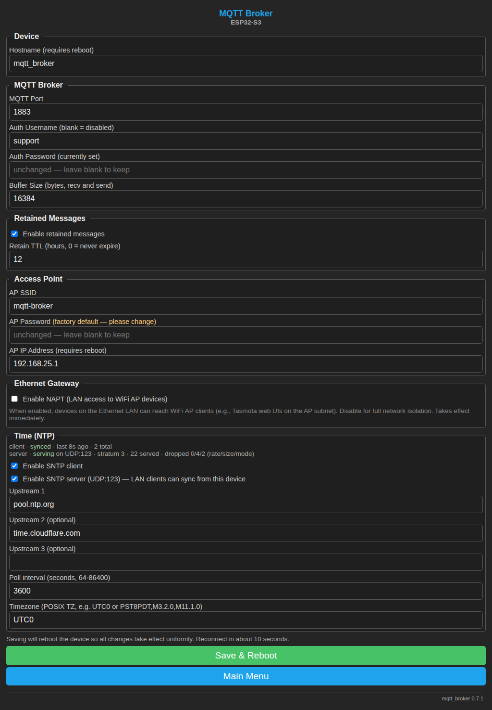
      </a>
      <br/><sub><b>Settings</b></sub>
    </td>
  </tr>
</table>

<details>
<summary><b>More screenshots</b> &mdash; click to expand</summary>

### Live device monitoring

<table>
  <tr>
    <td align="center" width="50%">
      <a href="docs/screenshots/ux-audit/clients_desktop.png">
        
      </a>
      <br/><sub>Connected MQTT + WiFi AP clients, live in-place refresh every 3s.</sub>
    </td>
    <td align="center" width="50%">
      <a href="docs/screenshots/ux-audit/information_desktop.png">
        
      </a>
      <br/><sub>Read-only device info: chip, MAC, PSRAM, firmware, partitions.</sub>
    </td>
  </tr>
  <tr>
    <td align="center">
      <a href="docs/screenshots/ux-audit/tester_desktop.png">
        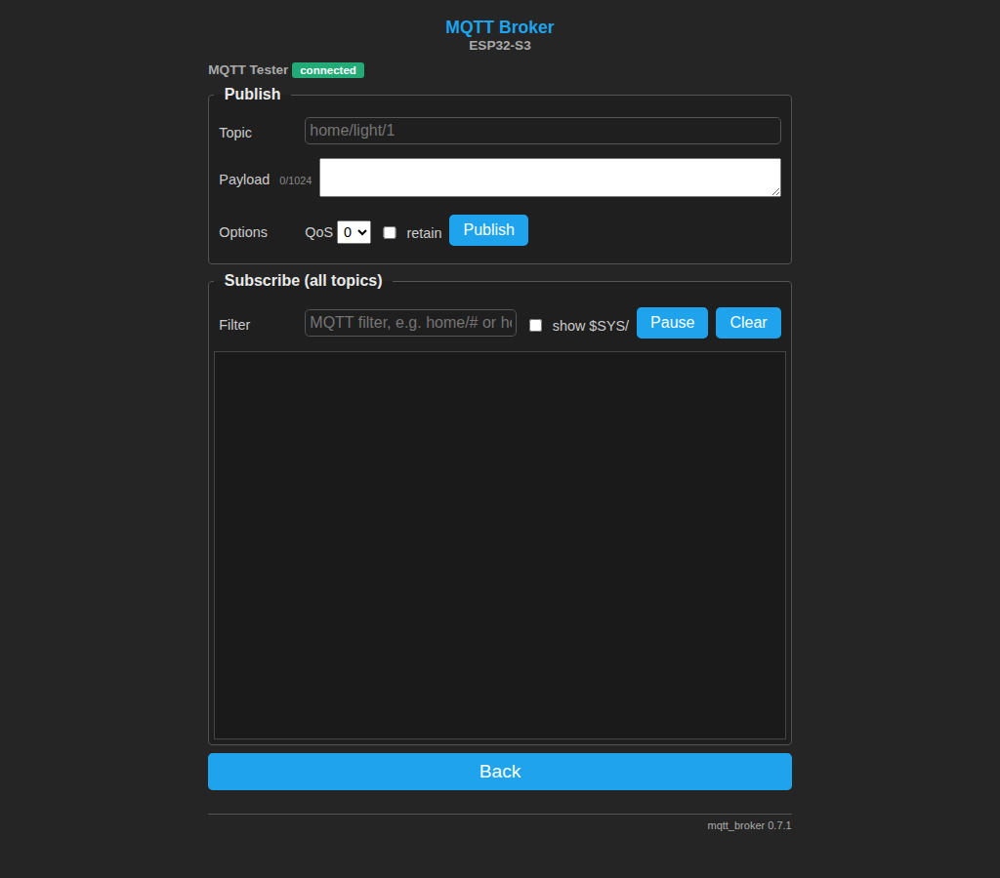
      </a>
      <br/><sub>WebSocket-backed MQTT tester: publish (QoS 0/1, retain), subscribe with real wildcard matching.</sub>
    </td>
    <td align="center">
      <a href="docs/screenshots/ux-audit/firmware_update_desktop.png">
        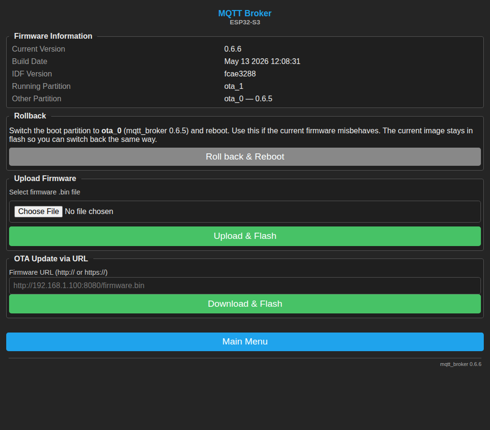
      </a>
      <br/><sub>OTA: file upload, URL fetch (http+https), manual rollback to the other partition.</sub>
    </td>
  </tr>
</table>

### Setup, save &amp; reboot

<table>
  <tr>
    <td align="center" width="50%">
      <a href="docs/screenshots/ux-audit/wifi_config_desktop.png">
        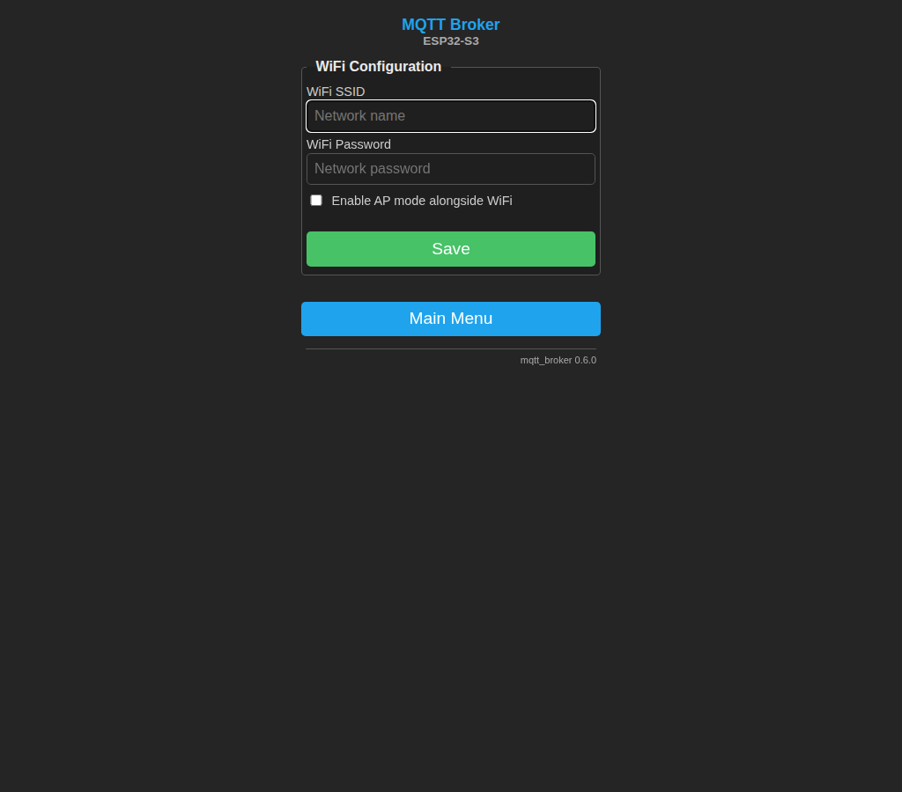
      </a>
      <br/><sub>Captive-portal first-boot WiFi setup. Saves + reboots in one click.</sub>
    </td>
    <td align="center" width="50%">
      <a href="docs/screenshots/ux-audit/save_reboot_confirm.png">
        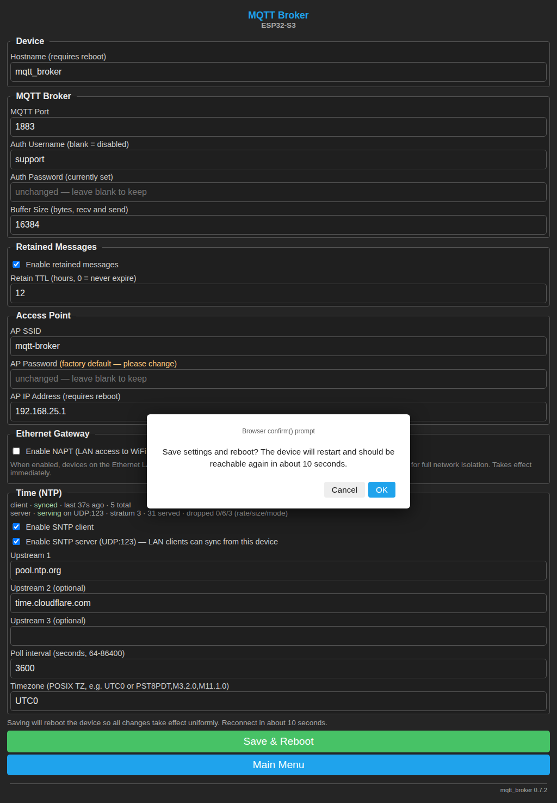
      </a>
      <br/><sub>Every settings change asks before triggering a reboot.</sub>
    </td>
  </tr>
  <tr>
    <td align="center">
      <a href="docs/screenshots/ux-audit/rebooting_offline.png">
        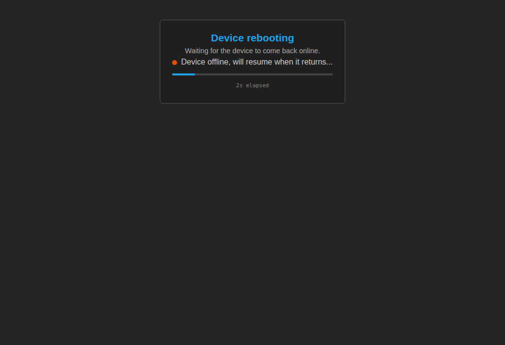
      </a>
      <br/><sub>Reboot countdown page: polls /api/ping (open, no auth required), pulses orange while device is down.</sub>
    </td>
    <td align="center">
      <a href="docs/screenshots/ux-audit/save_reboot_countdown.png">
        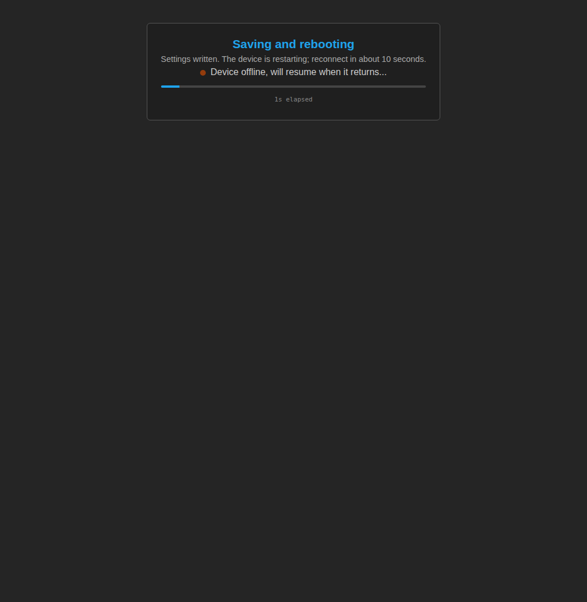
      </a>
      <br/><sub>After saving: <code>Saved. Polling device — will redirect home when it comes back online.</code></sub>
    </td>
  </tr>
</table>

### Mobile views (390 × 844 @ 2x)

<table>
  <tr>
    <td align="center" width="33%">
      <a href="docs/screenshots/ux-audit/dashboard_mobile.png">
        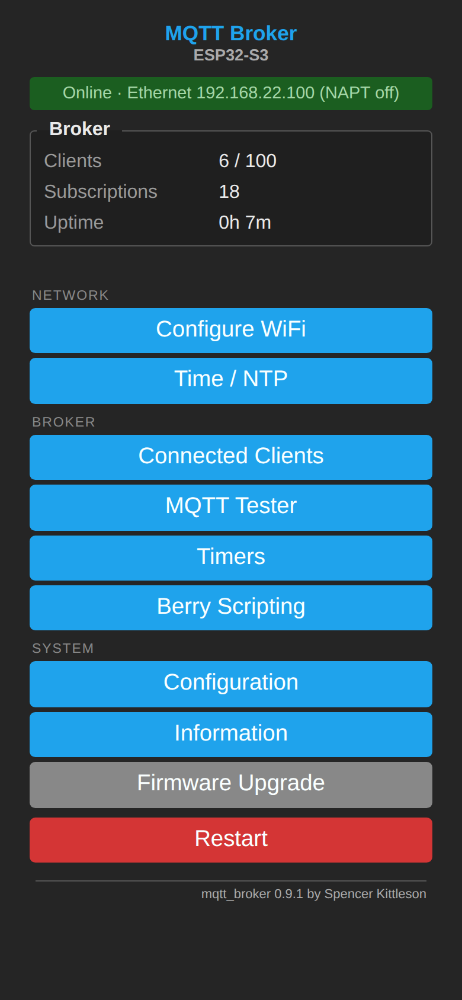
      </a>
      <br/><sub>Dashboard</sub>
    </td>
    <td align="center" width="33%">
      <a href="docs/screenshots/ux-audit/time_mobile.png">
        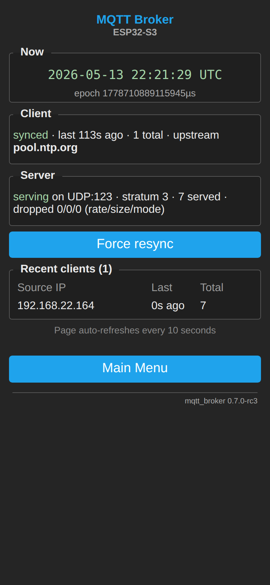
      </a>
      <br/><sub>Time / NTP</sub>
    </td>
    <td align="center" width="33%">
      <a href="docs/screenshots/ux-audit/settings_mobile.png">
        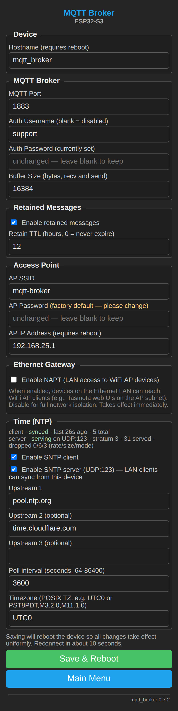
      </a>
      <br/><sub>Settings</sub>
    </td>
  </tr>
  <tr>
    <td align="center">
      <a href="docs/screenshots/ux-audit/clients_mobile.png">
        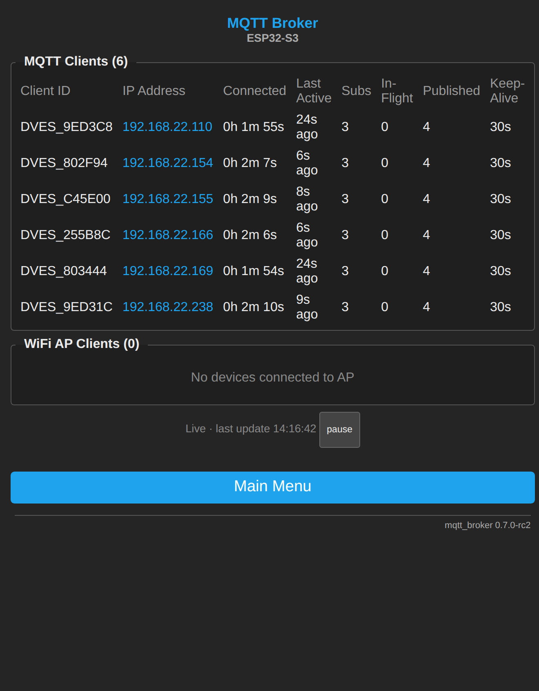
      </a>
      <br/><sub>Clients</sub>
    </td>
    <td align="center">
      <a href="docs/screenshots/ux-audit/tester_mobile.png">
        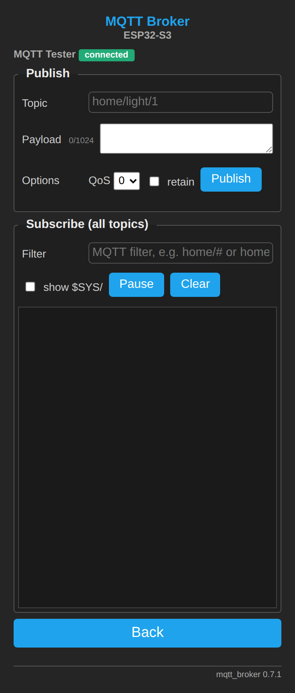
      </a>
      <br/><sub>Tester</sub>
    </td>
    <td align="center">
      <a href="docs/screenshots/ux-audit/firmware_update_mobile.png">
        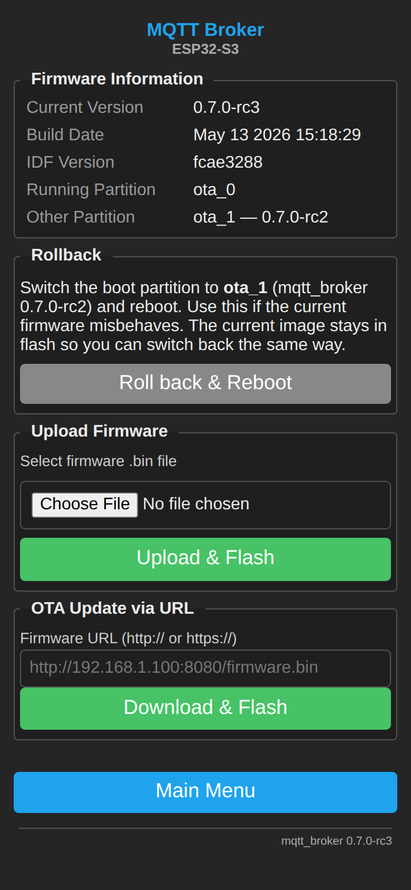
      </a>
      <br/><sub>Firmware Update</sub>
    </td>
  </tr>
</table>

</details>

> **Refreshing screenshots.** All captures are reproducible from any live
> device with `make captures` (uses `tools/capture_*.py`, Playwright). Set
> `PORTAL_URL` and `PORTAL_AUTH` env vars to target a non-default device:
>
> ```bash
> PORTAL_URL=http://192.168.22.100 PORTAL_AUTH=admin:secret make captures
> ```
>
> Credentials are read in-process only — never written to commits or
> embedded in any PNG. See [`plan-mqtt-ux-v2.md`](plan-mqtt-ux-v2.md) for
> the UX audit those captures back.

### Main Dashboard (`/`)

The dashboard shows live broker status at a glance:

- **WiFi status** — SSID, IP address, AP mode
- **Broker stats** — connected clients, subscriptions, retained messages, uptime, heap
- **MQTT authentication** — enabled/disabled status
- **Access point** — AP SSID, password, IP
- **Device info** — chip revision, MAC address, PSRAM, flash size, firmware version + build date
- **System controls** — Connected Clients, Configuration, Firmware Update, Restart, Clear WiFi

### Connected Clients (`/clients`)

A live view of every device connected to the broker, refreshing **in place** every 3 seconds via `fetch('/api/clients')` (no full-page reload — scroll position, text selection, and any mid-copy state survive). A `pause` button and a visible `Live · last update HH:MM:SS` indicator put the user in control; polling automatically stops when the tab is hidden. A `<noscript>` fallback still does a hard reload for JS-disabled clients.

- **MQTT Clients** — client ID, IP address, connection duration, last activity, subscription count, in-flight count, published count, keep-alive interval
- **WiFi AP Clients** — MAC address and RSSI signal strength for every device connected to the ESP32's access point

```bash
# JSON API for programmatic access
curl http://192.168.x.x/api/clients
```

```json
{
  "mqtt": [
    {
      "client_id": "sensor-kitchen",
      "ip": "192.168.8.42",
      "connected_s": 3600,
      "last_active_s": 2,
      "subs": 3,
      "inflight": 0,
      "published": 142,
      "keep_alive": 60
    },
    {
      "client_id": "thermostat-01",
      "ip": "192.168.8.50",
      "connected_s": 7200,
      "last_active_s": 0,
      "subs": 1,
      "inflight": 2,
      "published": 47,
      "keep_alive": 30
    }
  ],
  "wifi_ap": [
    { "mac": "AA:BB:CC:DD:EE:01", "rssi": -45 },
    { "mac": "AA:BB:CC:DD:EE:02", "rssi": -62 }
  ]
}
```

### Settings Page (`/settings`)

All broker settings are configurable from the web UI:

- **MQTT port** (default: 1883)
- **Authentication** — username and password (blank = open broker)
- **Buffer size** — recv/send buffer per client (1 KB to 64 KB, default 16 KB)
- **Retained messages** — enable/disable, TTL in hours (0 = never expire)
- **AP SSID and password** — customize the access point name

All settings are persisted to NVS flash and survive reboots.

### Firmware Update (`/update`)

The firmware update page provides three flows for over-the-air (OTA) management:

- **File Upload** — select a `.bin` firmware file from your computer and upload it directly to the device. Includes a progress bar and automatic reboot on success.
- **URL Fetch** — provide an `http://` or `https://` URL to a hosted firmware binary. The device downloads and flashes it.
- **Rollback** — if the _other_ OTA partition holds a valid app, the page shows its version and offers a `Roll back & Reboot` button. One click switches `esp_ota_set_boot_partition` back to the previous slot and reboots. The current image stays in flash, so the same button bounces you back. This is manual rollback by design — bootloader auto-rollback is not enabled (it would brick first upgrade without an in-app self-test wired up; that's on the roadmap).

The device uses dual OTA partitions (`ota_0` / `ota_1`) so the running firmware is never overwritten during an update. If an update fails to validate, the previous firmware remains intact.

```bash
# Upload via curl (takes ~20s for a 1.1 MB image over Ethernet)
curl -F "firmware=@build/mqtt_broker.bin" http://192.168.x.x/ota-upload

# Or trigger URL-based OTA (http:// or https://)
curl -X POST -d "url=http://192.168.1.100:8080/mqtt_broker.bin" http://192.168.x.x/ota-url

# Manual rollback to the other partition
curl -X POST http://192.168.x.x/ota-rollback
```

The update page also shows current firmware information (version, build date, IDF version, running partition) **and** the other partition's version, so you can see what rollback would restore to before you click.

### JSON API (`/api/status`)

```json
{
  "wifi": {
    "connected": true,
    "ssid": "MyNetwork",
    "ip": "192.168.1.100",
    "ap": true
  },
  "broker": {
    "clients": 12,
    "max_clients": 100,
    "subs": 47,
    "retained": 3,
    "retained_kb": 1,
    "port": 1883
  },
  "firmware": {
    "name": "mqtt_broker",
    "version": "1.0.0",
    "build": "Apr 28 2026 12:55:31"
  },
  "system": {
    "uptime_s": 86400,
    "free_heap_kb": 6300
  }
}
```

### All Endpoints

| Path               | Method   | Description                                                                                                              |
| ------------------ | -------- | ------------------------------------------------------------------------------------------------------------------------ |
| `/`                | GET      | Main dashboard with live stats                                                                                           |
| `/clients`         | GET      | Connected MQTT + WiFi AP clients (live, in-place refresh)                                                                |
| `/settings`        | GET      | Settings form (MQTT, retain, AP)                                                                                         |
| `/config`          | GET      | WiFi configuration form                                                                                                  |
| `/update`          | GET      | Firmware update page (upload + URL)                                                                                      |
| `/ota-upload`      | POST     | OTA firmware upload (multipart/form-data)                                                                                |
| `/ota-url`         | POST     | OTA firmware fetch from URL (`http://` or `https://`)                                                                    |
| `/ota-rollback`    | POST     | Switch boot partition to the other OTA slot and reboot                                                                   |
| `/rebooting`       | GET      | Standalone reboot countdown page (read-only, no reboot)                                                                  |
| `/api/ping`        | GET      | Open liveness endpoint (uptime only). Bypasses Basic Auth so the countdown page's polling never triggers an auth dialog. |
| `/api/time`        | GET      | Open NTP state: `{synced, epoch_us, last_sync_age_s, sync_count, upstream, server_running}`.                             |
| `/api/time/resync` | POST     | Gated. Force an immediate upstream poll.                                                                                 |
| UDP :123           | —        | SNTPv4 server. Stratum 16/LI=3 (alarm) when unsynced, stratum 3 once synced. Per-source rate limit, anti-amplification.  |
| `/time`            | GET      | Tasmota-style page: live clock, client+server status, force-resync button, recent-clients table.                         |
| mDNS `_ntp._udp`   | UDP/5353 | Service advertisement so Avahi-aware clients auto-discover the broker as a time source.                                  |
| `/save-settings`   | POST     | Save broker/AP settings to NVS                                                                                           |
| `/save`            | POST     | Save WiFi credentials                                                                                                    |
| `/clear`           | GET      | Clear saved WiFi credentials                                                                                             |
| `/reconnect`       | GET      | Reconnect to saved WiFi                                                                                                  |
| `/ap-toggle`       | GET      | Toggle AP mode                                                                                                           |
| `/reboot`          | GET      | Reboot the device                                                                                                        |
| `/api/status`      | GET      | JSON API — broker stats, firmware version                                                                                |
| `/api/clients`     | GET      | JSON API — connected MQTT + WiFi AP clients                                                                              |

## Configuration

### Runtime Settings (Web Portal)

These settings are configurable from the web UI at `/settings` and persisted in NVS:

| Setting           | Default        | Range                      | Notes                                                      |
| ----------------- | -------------- | -------------------------- | ---------------------------------------------------------- |
| MQTT Port         | 1883           | 1–65535                    | Takes effect after reboot                                  |
| Auth Username     | _(empty)_      | —                          | Empty = auth disabled                                      |
| Auth Password     | _(empty)_      | —                          | Only used when username is set                             |
| Buffer Size       | 16,384         | 1,024–65,536               | Per-client recv + shared send buffer                       |
| Retained Messages | Enabled        | on/off                     | Disable to reject all retain flags                         |
| Retain TTL        | 168 hours      | 0–8,760                    | 0 = never expire                                           |
| AP SSID           | `mqtt-broker`  | 1–32 chars                 | —                                                          |
| AP Password       | `mqtt1234`     | 8–63 chars                 | WPA2-PSK                                                   |
| AP IP Address     | `192.168.25.1` | Valid IPv4                 | Requires reboot; also configurable at compile time         |
| Hostname          | `mqtt_broker`  | 1–32 chars `[A-Za-z0-9_-]` | Used for DHCP + mDNS (`<hostname>.local`); requires reboot |
| NAPT              | Enabled        | on/off                     | Ethernet builds only; toggles LAN ↔ AP routing immediately |

### Compile-Time Settings

| Setting                   | Default         | File                                                              |
| ------------------------- | --------------- | ----------------------------------------------------------------- |
| Firmware version          | 0.7.0           | `version.h` (mirrored into IDF `PROJECT_VER` by `CMakeLists.txt`) |
| Default hostname          | `mqtt_broker`   | `Kconfig.projbuild` (`MQTT_BROKER_HOSTNAME`)                      |
| Max clients               | 100             | `mqtt_broker.h`                                                   |
| Max subscriptions         | 2,048           | `mqtt_broker.h`                                                   |
| MQTT port                 | 1883            | `mqtt_broker.h`                                                   |
| Keepalive grace           | 10 seconds      | `mqtt_broker.h`                                                   |
| Max retained msg size     | 64 KB           | `mqtt_broker.h`                                                   |
| Retain memory cap         | 80% PSRAM       | `mqtt_broker.h`                                                   |
| QoS-1 in-flight / client  | 20 msgs         | `mqtt_broker.h` (`BROKER_INFLIGHT_PER_CLIENT_MAX`)                |
| QoS-1 in-flight total cap | 2 MB            | `mqtt_broker.h` (`BROKER_INFLIGHT_TOTAL_BYTES_MAX`)               |
| QoS-1 retry initial       | 15 s            | `mqtt_broker.h` (`BROKER_INFLIGHT_RETRY_INITIAL_MS`)              |
| QoS-1 retry max           | 5 attempts      | `mqtt_broker.h` (`BROKER_INFLIGHT_RETRY_MAX`)                     |
| Default WiFi SSID         | _(empty)_       | `wifi_connect.h`                                                  |
| AP IP Address             | `192.168.25.1`  | `Kconfig.projbuild`                                               |
| AP Netmask                | `255.255.255.0` | `Kconfig.projbuild`                                               |
| LED GPIO                  | 21              | `main.c`                                                          |

### Scaling the Client Limit

The broker is configured for **100 concurrent MQTT clients** out of the box. If
you need more (or want to free memory by allowing fewer), three settings have
to stay in agreement:

| Setting                      | Default | Where                              | Rule                                          |
| ---------------------------- | ------- | ---------------------------------- | --------------------------------------------- |
| `MQTT_BROKER_MAX_CLIENTS`    | 100     | `main/mqtt_broker.h`               | Broker-level cap on accepted MQTT clients     |
| `CONFIG_LWIP_MAX_SOCKETS`    | 115     | `sdkconfig` / `sdkconfig.defaults` | ≥ max_clients + ~15 (listener + portal + DNS) |
| `CONFIG_LWIP_MAX_ACTIVE_TCP` | 115     | `sdkconfig` / `sdkconfig.defaults` | Same as `MAX_SOCKETS`                         |

The ~15 headroom covers: 1 MQTT listen socket, the HTTP portal (up to ~5
concurrent), the DNS hijack socket, mDNS, OTA HTTP fetch, and short-lived
sockets during accept/close transitions.

Memory cost of raising the limit (per added client):

- ~16 KB PSRAM recv buffer (configurable via `/settings` Buffer Size)
- ~100 bytes of internal client struct
- ~2 KB of lwIP per-socket overhead in DRAM (this is the tight constraint)

In practice **150 clients is the realistic ceiling** on an ESP32-S3 with 8 MB
PSRAM before internal DRAM (not PSRAM) for lwIP runs out. Past that you should
run two brokers and partition your devices between them.

To change it:

```bash
# 1. Edit main/mqtt_broker.h
#    #define MQTT_BROKER_MAX_CLIENTS 150

# 2. Edit sdkconfig (or run menuconfig → Component config → LWIP)
#    CONFIG_LWIP_MAX_SOCKETS=165
#    CONFIG_LWIP_MAX_ACTIVE_TCP=165

idf.py fullclean && idf.py build flash
```

If you forget step 2, new clients will silently fail to connect once the lwIP
socket pool is exhausted — even though the broker still has free MQTT client
slots.

## Architecture

The broker runs as a single FreeRTOS task pinned to Core 1 (Core 0 handles WiFi). It uses a `select()` event loop for non-blocking I/O across all client sockets.

### Flash Partition Layout (16 MB)

| Partition | Offset   | Size  | Purpose                          |
| --------- | -------- | ----- | -------------------------------- |
| nvs       | 0x9000   | 24 KB | Settings, WiFi credentials, auth |
| otadata   | 0xF000   | 8 KB  | OTA boot selection               |
| ota_0     | 0x20000  | 4 MB  | App slot A                       |
| ota_1     | 0x420000 | 4 MB  | App slot B                       |

OTA updates alternate between ota_0 and ota_1. The running partition is never overwritten.

```
app_main()
  ├── NVS init
  ├── LED init + led_task (Core 0, 2 KB stack)
  ├── WiFi STA connect (blocks up to 60s)
  │     └── AP fallback if STA fails
  ├── wifi_set_ap_mode(1)  →  AP+STA mode
  ├── portal_start()
  │     ├── portal_http_task (port 80, 12 KB stack)
  │     └── portal_dns_task  (port 53, 12 KB stack)
  └── broker_start()
        └── broker_task (Core 1, 16 KB stack)
              ├── Load config from NVS (port, auth, retain, buffers)
              ├── Allocate clients[] from PSRAM (100 × struct)
              ├── Allocate per-client recv buffers from PSRAM
              ├── Allocate subs[] from PSRAM (2048 × struct)
              ├── Allocate inflight[100][20] from PSRAM (QoS-1 tracking)
              ├── Allocate send buffer from PSRAM
              ├── Bind TCP socket on port 1883
              └── select() loop
                    ├── accept() new clients
                    ├── recv() → parse MQTT → route messages
                    ├── Keep-alive enforcement (every 5s)
                    ├── Stats logging (every 30s)
                    └── Retained message expiry
```

### Memory Layout (8 MB PSRAM)

| Allocation            | Size            | Notes                                                                  |
| --------------------- | --------------- | ---------------------------------------------------------------------- |
| Client structs        | ~10 KB          | 100 × broker_client_t (without recv buf)                               |
| Recv buffers          | 1,600 KB        | 100 × 16 KB (configurable)                                             |
| Subscription pool     | 280 KB          | 2,048 × broker_sub_t                                                   |
| Send buffer           | 16 KB           | Shared, configurable                                                   |
| QoS-1 in-flight slots | ~96 KB          | 100 × 20 × broker_inflight_t (headers only; payloads on-demand)        |
| QoS-1 in-flight bytes | up to 2 MB      | Dynamic topic+payload allocs, cap enforced; overflow degrades to QoS 0 |
| Retained messages     | Up to ~5,120 KB | 80% of remaining PSRAM                                                 |
| **Free heap**         | ~6,250 KB       | Available for retained store + general use                             |

### MQTT QoS

The broker supports QoS 0 and QoS 1 in both directions. Delivery to a
subscriber is at `min(publisher_qos, granted_qos)` per [MQTT-3.3.1-9].

**Inbound QoS 1 (publisher → broker):** the broker accepts the PUBLISH,
fans it out, then sends a `PUBACK` to the publisher [MQTT-4.3.2-2]. The
broker takes ownership at PUBACK time — it does not wait for all
subscribers to receive before acking.

**Outbound QoS 1 (broker → subscriber):** when a subscriber is granted
QoS 1, every PUBLISH sent to them is held in an in-flight slot until the
matching PUBACK arrives. If the PUBACK doesn't come in time, the broker
retransmits with `DUP=1`:

| Setting                  | Default  | Notes                                                                                                                                                                                                                                                                                                                           |
| ------------------------ | -------- | ------------------------------------------------------------------------------------------------------------------------------------------------------------------------------------------------------------------------------------------------------------------------------------------------------------------------------- |
| In-flight slots / client | 20       | After 20 unacked messages, further QoS-1 sends to that client degrade to QoS 0 (still delivered)                                                                                                                                                                                                                                |
| Global memory cap        | 2 MB     | Total topic+payload bytes across all in-flight messages; overflow also degrades to QoS 0                                                                                                                                                                                                                                        |
| First retry              | 15 s     | Time after the original send                                                                                                                                                                                                                                                                                                    |
| Retry backoff            | ×2       | 15 s, 30 s, 60 s, 60 s, 60 s                                                                                                                                                                                                                                                                                                    |
| Max retries              | 5        | After which the broker logs and abandons the message                                                                                                                                                                                                                                                                            |
| Persistence              | RAM only | In-flight state is volatile — a broker reboot drops all queues. Subscribers with `clean_session=false` get `session present=0` and must resubscribe. Phase 4 will add PSRAM-resident persistent sessions; flash-backed persistence is intentionally out of scope (10-year device-life goal precludes per-message flash writes). |

The per-client `inflight` count is exposed on the `/clients` page and in
`GET /api/clients` so you can watch the queue depth in real time.

QoS 2 is **not yet implemented.** Inbound QoS-2 PUBLISH packets are
silently dropped (the publisher retries with DUP=1, matching pre-QoS-1
behaviour); SUBACK clamps any requested QoS ≥ 2 down to 1.

### Source Files

```
main/
├── main.c            Entry point: NVS, WiFi, LED, portal, broker startup
├── version.h         Firmware version defines (semver + name)
├── mqtt_broker.h     Broker config defines, stats API
├── mqtt_broker.c     MQTT broker core: select() loop, client/sub management, QoS-1 in-flight retry tables
├── mqtt_parser.h     MQTT 3.1.1 packet structures and API
├── mqtt_parser.c     Packet parser/serializer, topic matching
├── portal.h          Captive portal API
├── portal.c          HTTP server, DNS hijack, settings UI, JSON API, OTA handlers
├── eth_connect.h     Ethernet W5500 API (optional, compile-time flag)
├── eth_connect.c     W5500 SPI init, DHCP, NAPT bridging
├── wifi_connect.h    WiFi API and defaults
└── wifi_connect.c    WiFi STA/AP, NVS persistence, portal callbacks
```

## Testing

The project includes a comprehensive Python test suite that runs all
features against a live broker instance. There is no host-build of the
firmware today; tests target the real radio + Ethernet stack on a
flashed device.

### Run tests

```bash
pip install paho-mqtt requests ntplib jsonschema

# Everything (MQTT + NTP), against default host (192.168.22.100):
make test

# Just NTP (13 tests; SNTP client+server, mDNS, /api/time, /time page,
# defensive guards on UDP:123):
BROKER_HOST=192.168.22.100 make test-ntp

# Just MQTT broker (116 tests; protocol + portal + retained + QoS 1 etc.):
BROKER_HOST=192.168.22.100 make test-broker

# If the portal has Basic Auth on:
BROKER_AUTH=admin:secret make test

# Destructive cycle (POST /save-settings; reboots the device 2-3 times;
# ~2 min extra). Skipped by default in the fast suite.
BROKER_TEST_DESTRUCTIVE=1 make test

# Raw invocations (skip the Makefile):
python3 test_broker.py 192.168.1.100 1883
BROKER_HOST=192.168.1.100 python3 test_ntp.py
```

### Test Coverage

The test suite runs **~118 assertions** across 21 test sections:

| #   | Test                     | What it verifies                                                                |
| --- | ------------------------ | ------------------------------------------------------------------------------- |
| 1   | Basic Connect/Disconnect | CONNECT, empty client ID, PINGREQ/PINGRESP, DISCONNECT                          |
| 2   | Publish/Subscribe        | Single topic delivery, multi-topic delivery                                     |
| 3   | Wildcard Subscriptions   | `+` match/exclude, `#` match/exclude, `$SYS` protection                         |
| 4   | Retained Messages        | Store + deliver to new subscriber, delete with empty payload                    |
| 5   | Binary/Image Payloads    | 100B to 15KB with MD5 integrity verification                                    |
| 6   | Concurrent Connections   | 50 simultaneous clients, all respond to PING                                    |
| 7   | Message Throughput       | 200 messages, 100% QoS 0 delivery rate                                          |
| 8   | Pub-to-Sub Latency       | 50 samples, average under 300ms over WiFi                                       |
| 9   | Duplicate Client ID      | Second client displaces first (per MQTT spec)                                   |
| 10  | Keep-Alive Enforcement   | 2s keepalive, disconnected after timeout + grace                                |
| 11  | Many Topics              | 100 unique topics across 5 subscribers                                          |
| 12  | Web Portal API           | JSON structure validation, all fields present                                   |
| 13  | Web Portal Pages         | All pages return 200, unknown paths return 404                                  |
| 14  | Portal Settings Save     | POST save, persistence verification, input validation                           |
| 15  | Unsubscribe              | Receives before, silent after unsubscribe                                       |
| 16  | QoS 1 Inbound            | PUBACK round-trip, 20-msg burst all acknowledged + delivered                    |
| 17  | QoS 1 Outbound           | SUBACK grants 1, min(pub,granted) per delivery, exactly-once, in-flight settles |

### Stress Test

A separate stress test exercises the broker under sustained load:

```bash
python3 stress_test.py
```

Tests: 90 concurrent connections, 500-message throughput, wildcard routing, latency profiling, 255 unique topics, authentication flows.

## LED Status

| Pattern    | Color  | Meaning                                           |
| ---------- | ------ | ------------------------------------------------- |
| Fast blink | Blue   | Booting                                           |
| 2-blink    | Yellow | Connecting to WiFi                                |
| 3-blink    | Red    | WiFi failed, AP mode active                       |
| Slow pulse | Green  | WiFi connected, broker running                    |
| Slow pulse | Cyan   | AP-only mode, portal running                      |
| Slow pulse | White  | Ethernet gateway mode (W5500 connected + WiFi AP) |

## Network Modes

The device operates in one of these WiFi modes:

| Mode        | When                                     | Broker              | Portal            |
| ----------- | ---------------------------------------- | ------------------- | ----------------- |
| **STA**     | Connected to WiFi, AP disabled           | `<WiFi IP>:1883`    | `<WiFi IP>:80`    |
| **AP+STA**  | Connected to WiFi, AP enabled (default)  | `<WiFi IP>:1883`    | Both IPs on `:80` |
| **AP only** | No WiFi credentials or connection failed | `192.168.25.1:1883` | `192.168.25.1:80` |

### Ethernet Gateway (W5500)

When built with `CONFIG_MQTT_BROKER_ETHERNET=y`, the ESP32 acts as a gateway between a wired LAN and the WiFi AP subnet. This requires a W5500 SPI Ethernet module (e.g., Waveshare ESP32-S3-ETH).

```
[Your LAN / PC]                    [Tasmota Device A: 192.168.25.2]
      |                                      |
  [Ethernet / W5500]              [WiFi AP: 192.168.25.1/24]
      |                                      |
      +----------[ ESP32-S3 MQTT Broker ]----+
                   NAPT bridges the two subnets
```

**Why this matters:**

IoT devices on the WiFi AP subnet (`192.168.25.x`) are hardware-isolated from your main network — they can't reach your LAN and your LAN can't reach them. MQTT messages flow through the broker regardless, so normal pub/sub works fine without NAPT.

But when you need to interact with the devices directly — open a Tasmota web UI to change a setting, push an OTA firmware update, check a sensor's HTTP endpoint, or debug a device that's not responding to MQTT — you need IP-level access from your LAN to `192.168.25.x`. That's what NAPT provides.

**How NAPT works:**

1. The ESP32 gets an IP on your LAN via DHCP on the Ethernet interface (e.g., `10.0.0.50`)
2. WiFi AP runs on `192.168.25.0/24` as usual — Tasmota devices connect here
3. NAPT (Network Address Port Translation) on the WiFi AP interface translates packets from Ethernet → AP
4. From your PC, browse `http://192.168.25.2` and the ESP32 forwards the request with source NAT'd to `192.168.25.1` — the Tasmota device responds to the broker, which relays the response back to your PC

**Practical examples from your LAN:**

```bash
# Open a Tasmota device's web UI in your browser
open http://192.168.25.2

# Push a Tasmota command via HTTP
curl "http://192.168.25.2/cm?cmnd=Status%200"

# OTA flash a Tasmota device from your build machine
curl "http://192.168.25.3/u2" -F "file=@tasmota.bin"

# Ping a device to check if it's alive
ping 192.168.25.4
```

**NAPT toggle:**

NAPT can be enabled or disabled at runtime from the web portal's Configuration page. This is useful for debugging — enable NAPT when you need to reach devices directly, disable it when you want full network isolation. The setting persists across reboots via NVS.

**Building with Ethernet support:**

```bash
# Option 1: Uncomment the Ethernet lines in sdkconfig.defaults
# Option 2: Use the overlay file
cat sdkconfig.defaults sdkconfig.defaults.eth > sdkconfig.combined
idf.py -D SDKCONFIG_DEFAULTS="sdkconfig.combined" reconfigure
idf.py build
```

**SPI Pin Configuration (via menuconfig):**

| Signal | Default GPIO | Kconfig Key           |
| ------ | ------------ | --------------------- |
| MOSI   | 11           | `CONFIG_ETH_SPI_MOSI` |
| MISO   | 13           | `CONFIG_ETH_SPI_MISO` |
| SCLK   | 12           | `CONFIG_ETH_SPI_SCLK` |
| CS     | 10           | `CONFIG_ETH_SPI_CS`   |
| INT    | 4            | `CONFIG_ETH_SPI_INT`  |
| RST    | 5            | `CONFIG_ETH_SPI_RST`  |

Adjust via `idf.py menuconfig` > MQTT Broker Configuration.

## Project Structure

```
mqtt_esp32/
├── main/
│   ├── CMakeLists.txt          Component build config
│   ├── Kconfig.projbuild       Custom menuconfig options (Ethernet, pins)
│   ├── idf_component.yml       LED strip dependency
│   ├── main.c                  Application entry point
│   ├── version.h               Firmware version (semver)
│   ├── mqtt_broker.h/c         MQTT broker core
│   ├── mqtt_parser.h/c         MQTT protocol parser
│   ├── portal.h/c              Web portal + JSON API + OTA handlers
│   ├── wifi_connect.h/c        WiFi + NVS management
│   └── eth_connect.h/c         Ethernet W5500 + NAPT (optional, compile-time)
├── managed_components/         ESP-IDF managed components
│   └── espressif__led_strip/   WS2812 LED driver
├── partitions.csv              Custom OTA partition table (16MB flash)
├── test_broker.py              Comprehensive test suite (59 tests)
├── stress_test.py              Load/stress testing
├── CMakeLists.txt              Root project CMake
├── sdkconfig.defaults          ESP-IDF defaults (PSRAM, lwIP, OTA partitions)
└── README.md
```

## Contributing

Contributions are welcome. Please:

1. Fork the repository
2. Create a feature branch (`git checkout -b feature/my-feature`)
3. Make your changes
4. Run the test suite (`python3 test_broker.py`)
5. Submit a pull request

### Development Setup

```bash
# Install ESP-IDF v5.5
# https://docs.espressif.com/projects/esp-idf/en/latest/esp32s3/get-started/

source $IDF_PATH/export.sh
idf.py build
idf.py flash monitor
```

## Acknowledgments

The web portal UX is heavily inspired by the [Tasmota](https://tasmota.github.io/docs/) project. While the two projects have vastly different goals — Tasmota is a full-featured alternative firmware for ESP devices, this is a standalone MQTT broker — we liked their general approach to the web UI layout, navigation structure, and tools organization. The dark theme, full-width button menus, fieldset-based info sections, and Information/Configuration/Firmware Upgrade page split all take cues from Tasmota's clean and practical design.

## License

MIT License. See [LICENSE](LICENSE) for details.

This is a custom implementation with no external MQTT library dependencies. The only dependency beyond ESP-IDF core is `espressif/led_strip` for the WS2812 status LED.
