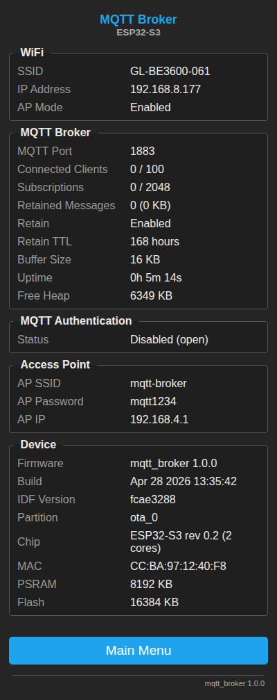

<p align="center">
  <h1 align="center">ESP32 MQTT Broker</h1>
  <p align="center">
    A standalone MQTT 3.1.1 broker that runs entirely on an ESP32-S3 microcontroller.
    <br />
    No cloud. No server. Just plug it in.
    <br />
    <br />
    <a href="#quick-start">Quick Start</a>
    &middot;
    <a href="#use-cases">Use Cases</a>
    &middot;
    <a href="#web-portal">Web Portal</a>
    &middot;
    <a href="#configuration">Configuration</a>
    &middot;
    <a href="#testing">Testing</a>
    &middot;
    <a href="#architecture">Architecture</a>
  </p>
</p>

<p align="center">
  
  
  
  
  
  
</p>

---

## Why?

Most MQTT setups need a Raspberry Pi, a cloud service, or a dedicated server running Mosquitto. This project puts the entire broker on a $10 microcontroller. It connects to your WiFi, starts accepting MQTT clients on port 1883, and runs a Tasmota-style web UI for configuration. No dependencies, no Docker, no Linux.

Built for home automation, IoT sensor networks, and edge deployments where you need a reliable local broker with zero maintenance.

## Use Cases

### Home Automation Hub

Run the broker on your home network alongside Zigbee/Z-Wave bridges, ESPHome devices, and Home Assistant. Every sensor and actuator talks MQTT through a local broker with no cloud dependency. The web portal lets you monitor exactly which devices are connected and what topics they're subscribed to.

### Mobile / Field Deployments

Power the ESP32 from a USB battery pack and take your MQTT infrastructure anywhere. The device creates its own WiFi AP — sensors and controllers connect directly without needing existing network infrastructure. Ideal for trade shows, temporary installations, agricultural monitoring, or testing in the field.

### Network Isolation (2.4 GHz to Ethernet Bridge)

Use the Waveshare ESP32-S3-ETH board to bridge IoT devices on an isolated 2.4 GHz WiFi network to your wired LAN. IoT devices connect to the ESP32's AP, the broker handles messaging, and the Ethernet port connects to your main network. This keeps IoT traffic off your primary WiFi and provides a hardware-level network boundary.

### Client Tracking and Monitoring

Every connected MQTT client is visible in the web portal with its client ID, IP address, connection duration, subscription count, and keep-alive interval. WiFi AP clients show MAC addresses and signal strength. The `/api/clients` JSON endpoint makes it easy to build dashboards, alerting, or inventory systems that track which devices are online and what they're doing.

## Features

| Category | Details |
|----------|---------|
| **Protocol** | Full MQTT 3.1.1 — CONNECT, SUBSCRIBE, PUBLISH, UNSUBSCRIBE, PINGREQ, DISCONNECT |
| **Clients** | 100 concurrent connections, pre-allocated in PSRAM |
| **Subscriptions** | 2,048 total entries across all clients |
| **Wildcards** | `+` (single-level), `#` (multi-level), `$`-topic protection |
| **Retained Messages** | Configurable TTL (default 7 days), 64KB max per message, PSRAM-backed with FIFO eviction |
| **Binary Payloads** | Up to 16KB per message (configurable buffer size) — supports images, protobuf, etc. |
| **Authentication** | Optional username/password via MQTT CONNECT (CONNACK 0x04 on failure) |
| **Web Portal** | Tasmota-style dark theme UI for all settings, live stats, and device info |
| **Client Monitoring** | Live view of connected MQTT clients (ID, IP, uptime, subscriptions) and WiFi AP clients (MAC, RSSI) |
| **Firmware Version** | Semver display (Tasmota-style) on dashboard, footer, and JSON API |
| **OTA Updates** | Firmware upload via web UI (file upload) or HTTP URL fetch — dual OTA partitions |
| **JSON API** | `GET /api/status` returns broker stats, WiFi status, firmware version, and system info |
| **WiFi** | STA + AP mode, NVS credential persistence, automatic AP fallback |
| **Captive Portal** | DNS hijack + HTTP server for WiFi configuration on first boot |
| **LED Status** | WS2812 on GPIO21 — blue (boot), yellow (connecting), green (running), red (failed) |
| **Configuration** | All settings configurable via web UI, persisted to NVS flash |

## Hardware

| Component | Spec |
|-----------|------|
| Board | [Waveshare ESP32-S3-ETH](https://www.waveshare.com/wiki/ESP32-S3-ETH) (or any ESP32-S3 with PSRAM) |
| MCU | ESP32-S3 dual-core Xtensa LX7 @ 240 MHz |
| PSRAM | 8 MB octal SPI |
| Flash | 16 MB (dual 4 MB OTA partitions) |
| WiFi | 802.11 b/g/n 2.4 GHz |
| LED | WS2812 on GPIO21 |
| Console | USB-Serial/JTAG |

> Any ESP32-S3 board with PSRAM should work. The W5500 Ethernet on the Waveshare board is not used by the broker — it connects via WiFi.

## Quick Start

### Prerequisites

- [ESP-IDF v5.5+](https://docs.espressif.com/projects/esp-idf/en/latest/esp32s3/get-started/)
- USB cable to the ESP32-S3

### Build and Flash

```bash
# Set up ESP-IDF environment
source $IDF_PATH/export.sh

# Clone and build
git clone https://github.com/your-username/mqtt_esp32.git
cd mqtt_esp32
idf.py build

# Flash to the device
idf.py flash

# Monitor serial output (optional)
idf.py monitor
```

### First Boot

<p align="center">
  
</p>
<p align="center"><em>WiFi configuration captive portal on first boot.</em></p>

1. The device creates a WiFi access point: **`mqtt-broker`** (password: **`mqtt1234`**)
2. Connect to it and open **http://192.168.4.1** in your browser
3. Configure your WiFi credentials in the portal
4. The device reboots, connects to your WiFi, and starts the MQTT broker
5. Connect your MQTT clients to the device's IP on port **1883**

```bash
# Test with mosquitto
mosquitto_sub -h 192.168.x.x -t "test/#" -v &
mosquitto_pub -h 192.168.x.x -t "test/hello" -m "world"
```

## Web Portal

The broker includes a Tasmota-style web UI accessible at the device's IP address on port 80.

<p align="center">
  
  &nbsp;&nbsp;
  
</p>
<p align="center">
  <em>Left: Main dashboard with status and navigation. Right: Information page with full device details.</em>
</p>

### Main Dashboard (`/`)

The dashboard shows live broker status at a glance:

- **WiFi status** — SSID, IP address, AP mode
- **Broker stats** — connected clients, subscriptions, retained messages, uptime, heap
- **MQTT authentication** — enabled/disabled status
- **Access point** — AP SSID, password, IP
- **Device info** — chip revision, MAC address, PSRAM, flash size, firmware version + build date
- **System controls** — Connected Clients, Configuration, Firmware Update, Restart, Clear WiFi

### Connected Clients (`/clients`)

A live view of every device connected to the broker, auto-refreshing every 5 seconds:

- **MQTT Clients** — client ID, IP address, connection duration, last activity, subscription count, keep-alive interval
- **WiFi AP Clients** — MAC address and RSSI signal strength for every device connected to the ESP32's access point

```bash
# JSON API for programmatic access
curl http://192.168.x.x/api/clients
```

```json
{
  "mqtt": [
    {"client_id": "sensor-kitchen", "ip": "192.168.8.42", "connected_s": 3600, "last_active_s": 2, "subs": 3, "keep_alive": 60},
    {"client_id": "thermostat-01", "ip": "192.168.8.50", "connected_s": 7200, "last_active_s": 0, "subs": 1, "keep_alive": 30}
  ],
  "wifi_ap": [
    {"mac": "AA:BB:CC:DD:EE:01", "rssi": -45},
    {"mac": "AA:BB:CC:DD:EE:02", "rssi": -62}
  ]
}
```

### Settings Page (`/settings`)

All broker settings are configurable from the web UI:

- **MQTT port** (default: 1883)
- **Authentication** — username and password (blank = open broker)
- **Buffer size** — recv/send buffer per client (1 KB to 64 KB, default 16 KB)
- **Retained messages** — enable/disable, TTL in hours (0 = never expire)
- **AP SSID and password** — customize the access point name

All settings are persisted to NVS flash and survive reboots.

### Firmware Update (`/update`)

The firmware update page provides two methods for over-the-air (OTA) updates:

- **File Upload** — select a `.bin` firmware file from your computer and upload it directly to the device. Includes a progress bar and automatic reboot on success.
- **URL Fetch** — provide an HTTP URL to a hosted firmware binary. The device downloads and flashes it.

The device uses dual OTA partitions (ota_0 / ota_1) so the running firmware is never overwritten during an update. If an update fails, the previous firmware remains intact.

```bash
# Upload via curl
curl -F "firmware=@build/mqtt_broker.bin" http://192.168.x.x/ota-upload

# Or trigger URL-based OTA
curl -X POST -d "url=http://192.168.1.100:8080/mqtt_broker.bin" http://192.168.x.x/ota-url
```

The update page also shows current firmware information: version, build date, IDF version, and running partition.

### JSON API (`/api/status`)

```json
{
  "wifi": {
    "connected": true,
    "ssid": "MyNetwork",
    "ip": "192.168.1.100",
    "ap": true
  },
  "broker": {
    "clients": 12,
    "max_clients": 100,
    "subs": 47,
    "retained": 3,
    "retained_kb": 1,
    "port": 1883
  },
  "firmware": {
    "name": "mqtt_broker",
    "version": "1.0.0",
    "build": "Apr 28 2026 12:55:31"
  },
  "system": {
    "uptime_s": 86400,
    "free_heap_kb": 6300
  }
}
```

### All Endpoints

| Path | Method | Description |
|------|--------|-------------|
| `/` | GET | Main dashboard with live stats |
| `/clients` | GET | Connected MQTT + WiFi AP clients (auto-refresh) |
| `/settings` | GET | Settings form (MQTT, retain, AP) |
| `/config` | GET | WiFi configuration form |
| `/update` | GET | Firmware update page (upload + URL) |
| `/ota-upload` | POST | OTA firmware upload (multipart/form-data) |
| `/ota-url` | POST | OTA firmware fetch from URL |
| `/save-settings` | POST | Save broker/AP settings to NVS |
| `/save` | POST | Save WiFi credentials |
| `/clear` | GET | Clear saved WiFi credentials |
| `/reconnect` | GET | Reconnect to saved WiFi |
| `/ap-toggle` | GET | Toggle AP mode |
| `/reboot` | GET | Reboot the device |
| `/api/status` | GET | JSON API — broker stats, firmware version |
| `/api/clients` | GET | JSON API — connected MQTT + WiFi AP clients |

## Configuration

### Runtime Settings (Web Portal)

These settings are configurable from the web UI at `/settings` and persisted in NVS:

| Setting | Default | Range | Notes |
|---------|---------|-------|-------|
| MQTT Port | 1883 | 1–65535 | Takes effect after reboot |
| Auth Username | *(empty)* | — | Empty = auth disabled |
| Auth Password | *(empty)* | — | Only used when username is set |
| Buffer Size | 16,384 | 1,024–65,536 | Per-client recv + shared send buffer |
| Retained Messages | Enabled | on/off | Disable to reject all retain flags |
| Retain TTL | 168 hours | 0–8,760 | 0 = never expire |
| AP SSID | `mqtt-broker` | 1–32 chars | — |
| AP Password | `mqtt1234` | 8–63 chars | WPA2-PSK |

### Compile-Time Settings

| Setting | Default | File |
|---------|---------|------|
| Firmware version | 1.0.0 | `version.h` |
| Max clients | 100 | `mqtt_broker.h` |
| Max subscriptions | 2,048 | `mqtt_broker.h` |
| MQTT port | 1883 | `mqtt_broker.h` |
| Keepalive grace | 10 seconds | `mqtt_broker.h` |
| Max retained msg size | 64 KB | `mqtt_broker.h` |
| Retain memory cap | 80% PSRAM | `mqtt_broker.h` |
| Default WiFi SSID | *(empty)* | `wifi_connect.h` |
| LED GPIO | 21 | `main.c` |

## Architecture

The broker runs as a single FreeRTOS task pinned to Core 1 (Core 0 handles WiFi). It uses a `select()` event loop for non-blocking I/O across all client sockets.

### Flash Partition Layout (16 MB)

| Partition | Offset | Size | Purpose |
|-----------|--------|------|---------|
| nvs | 0x9000 | 24 KB | Settings, WiFi credentials, auth |
| otadata | 0xF000 | 8 KB | OTA boot selection |
| ota_0 | 0x20000 | 4 MB | App slot A |
| ota_1 | 0x420000 | 4 MB | App slot B |

OTA updates alternate between ota_0 and ota_1. The running partition is never overwritten.

```
app_main()
  ├── NVS init
  ├── LED init + led_task (Core 0, 2 KB stack)
  ├── WiFi STA connect (blocks up to 60s)
  │     └── AP fallback if STA fails
  ├── wifi_set_ap_mode(1)  →  AP+STA mode
  ├── portal_start()
  │     ├── portal_http_task (port 80, 12 KB stack)
  │     └── portal_dns_task  (port 53, 12 KB stack)
  └── broker_start()
        └── broker_task (Core 1, 16 KB stack)
              ├── Load config from NVS (port, auth, retain, buffers)
              ├── Allocate clients[] from PSRAM (100 × struct)
              ├── Allocate per-client recv buffers from PSRAM
              ├── Allocate subs[] from PSRAM (2048 × struct)
              ├── Allocate send buffer from PSRAM
              ├── Bind TCP socket on port 1883
              └── select() loop
                    ├── accept() new clients
                    ├── recv() → parse MQTT → route messages
                    ├── Keep-alive enforcement (every 5s)
                    ├── Stats logging (every 30s)
                    └── Retained message expiry
```

### Memory Layout (8 MB PSRAM)

| Allocation | Size | Notes |
|------------|------|-------|
| Client structs | ~10 KB | 100 × broker_client_t (without recv buf) |
| Recv buffers | 1,600 KB | 100 × 16 KB (configurable) |
| Subscription pool | 280 KB | 2,048 × broker_sub_t |
| Send buffer | 16 KB | Shared, configurable |
| Retained messages | Up to ~5,120 KB | 80% of remaining PSRAM |
| **Free heap** | ~6,300 KB | Available for retained store + general use |

### Source Files

```
main/
├── main.c            Entry point: NVS, WiFi, LED, portal, broker startup
├── version.h         Firmware version defines (semver + name)
├── mqtt_broker.h     Broker config defines, stats API
├── mqtt_broker.c     MQTT broker core: select() loop, client/sub management
├── mqtt_parser.h     MQTT 3.1.1 packet structures and API
├── mqtt_parser.c     Packet parser/serializer, topic matching
├── portal.h          Captive portal API
├── portal.c          HTTP server, DNS hijack, settings UI, JSON API, OTA handlers
├── wifi_connect.h    WiFi API and defaults
└── wifi_connect.c    WiFi STA/AP, NVS persistence, portal callbacks
```

## Testing

The project includes a comprehensive Python test suite that tests all features against a live broker instance.

### Run Tests

```bash
pip install paho-mqtt requests

# Run against default host (AP mode)
python3 test_broker.py

# Run against a specific host
python3 test_broker.py 192.168.1.100 1883
```

### Test Coverage

The test suite runs **59 assertions** across 15 test sections:

| # | Test | What it verifies |
|---|------|-----------------|
| 1 | Basic Connect/Disconnect | CONNECT, empty client ID, PINGREQ/PINGRESP, DISCONNECT |
| 2 | Publish/Subscribe | Single topic delivery, multi-topic delivery |
| 3 | Wildcard Subscriptions | `+` match/exclude, `#` match/exclude, `$SYS` protection |
| 4 | Retained Messages | Store + deliver to new subscriber, delete with empty payload |
| 5 | Binary/Image Payloads | 100B to 15KB with MD5 integrity verification |
| 6 | Concurrent Connections | 50 simultaneous clients, all respond to PING |
| 7 | Message Throughput | 200 messages, 100% QoS 0 delivery rate |
| 8 | Pub-to-Sub Latency | 50 samples, average under 300ms over WiFi |
| 9 | Duplicate Client ID | Second client displaces first (per MQTT spec) |
| 10 | Keep-Alive Enforcement | 2s keepalive, disconnected after timeout + grace |
| 11 | Many Topics | 100 unique topics across 5 subscribers |
| 12 | Web Portal API | JSON structure validation, all fields present |
| 13 | Web Portal Pages | All pages return 200, unknown paths return 404 |
| 14 | Portal Settings Save | POST save, persistence verification, input validation |
| 15 | Unsubscribe | Receives before, silent after unsubscribe |

### Stress Test

A separate stress test exercises the broker under sustained load:

```bash
python3 stress_test.py
```

Tests: 90 concurrent connections, 500-message throughput, wildcard routing, latency profiling, 255 unique topics, authentication flows.

## LED Status

| Pattern | Color | Meaning |
|---------|-------|---------|
| Fast blink | Blue | Booting |
| 2-blink | Yellow | Connecting to WiFi |
| 3-blink | Red | WiFi failed, AP mode active |
| Slow pulse | Green | WiFi connected, broker running |
| Slow pulse | Cyan | AP-only mode, portal running |

## Network Modes

The device operates in one of these WiFi modes:

| Mode | When | Broker | Portal |
|------|------|--------|--------|
| **STA** | Connected to WiFi, AP disabled | `<WiFi IP>:1883` | `<WiFi IP>:80` |
| **AP+STA** | Connected to WiFi, AP enabled (default) | `<WiFi IP>:1883` | Both IPs on `:80` |
| **AP only** | No WiFi credentials or connection failed | `192.168.4.1:1883` | `192.168.4.1:80` |

## Project Structure

```
mqtt_esp32/
├── main/
│   ├── CMakeLists.txt          Component build config
│   ├── idf_component.yml       LED strip dependency
│   ├── main.c                  Application entry point
│   ├── version.h               Firmware version (semver)
│   ├── mqtt_broker.h/c         MQTT broker core
│   ├── mqtt_parser.h/c         MQTT protocol parser
│   ├── portal.h/c              Web portal + JSON API + OTA handlers
│   └── wifi_connect.h/c        WiFi + NVS management
├── managed_components/         ESP-IDF managed components
│   └── espressif__led_strip/   WS2812 LED driver
├── partitions.csv              Custom OTA partition table (16MB flash)
├── test_broker.py              Comprehensive test suite (59 tests)
├── stress_test.py              Load/stress testing
├── CMakeLists.txt              Root project CMake
├── sdkconfig.defaults          ESP-IDF defaults (PSRAM, lwIP, OTA partitions)
└── README.md
```

## Contributing

Contributions are welcome. Please:

1. Fork the repository
2. Create a feature branch (`git checkout -b feature/my-feature`)
3. Make your changes
4. Run the test suite (`python3 test_broker.py`)
5. Submit a pull request

### Development Setup

```bash
# Install ESP-IDF v5.5
# https://docs.espressif.com/projects/esp-idf/en/latest/esp32s3/get-started/

source $IDF_PATH/export.sh
idf.py build
idf.py flash monitor
```

## Acknowledgments

The web portal UX is heavily inspired by the [Tasmota](https://tasmota.github.io/docs/) project. While the two projects have vastly different goals — Tasmota is a full-featured alternative firmware for ESP devices, this is a standalone MQTT broker — we liked their general approach to the web UI layout, navigation structure, and tools organization. The dark theme, full-width button menus, fieldset-based info sections, and Information/Configuration/Firmware Upgrade page split all take cues from Tasmota's clean and practical design.

## License

MIT License. See [LICENSE](LICENSE) for details.

This is a custom implementation with no external MQTT library dependencies. The only dependency beyond ESP-IDF core is `espressif/led_strip` for the WS2812 status LED.
