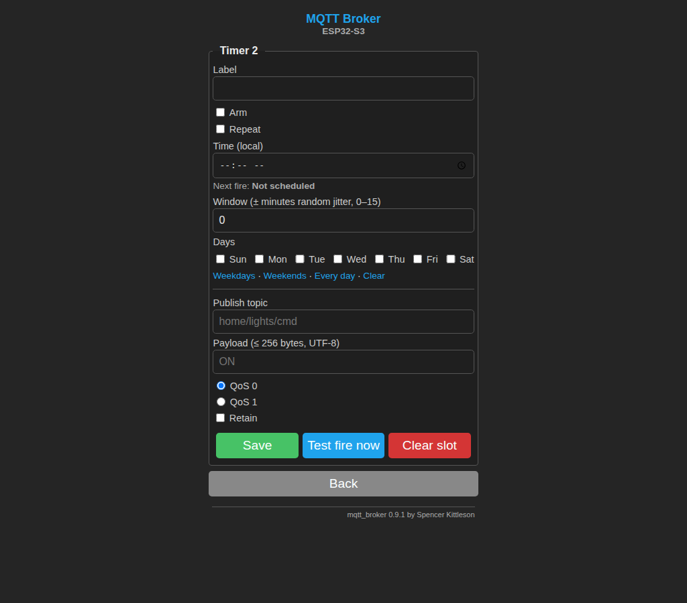
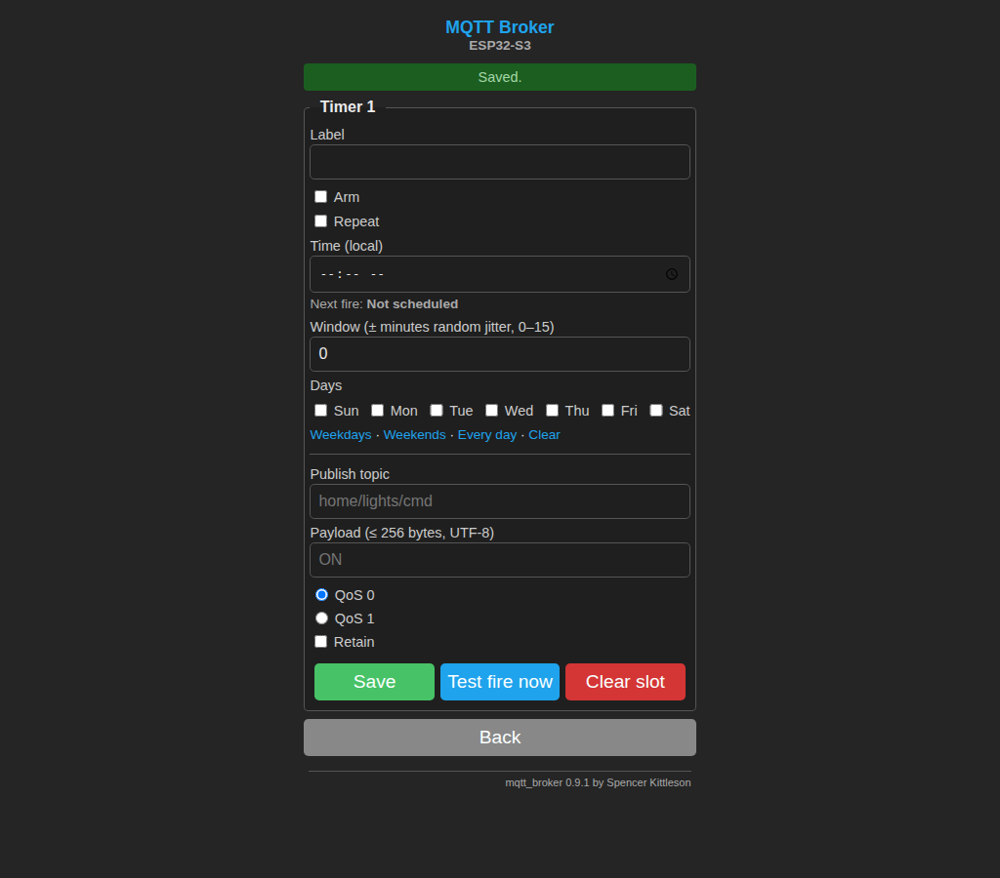
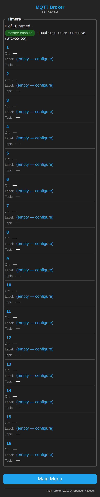
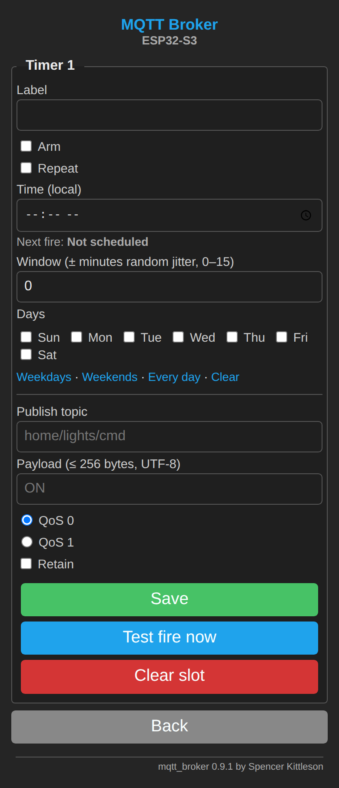
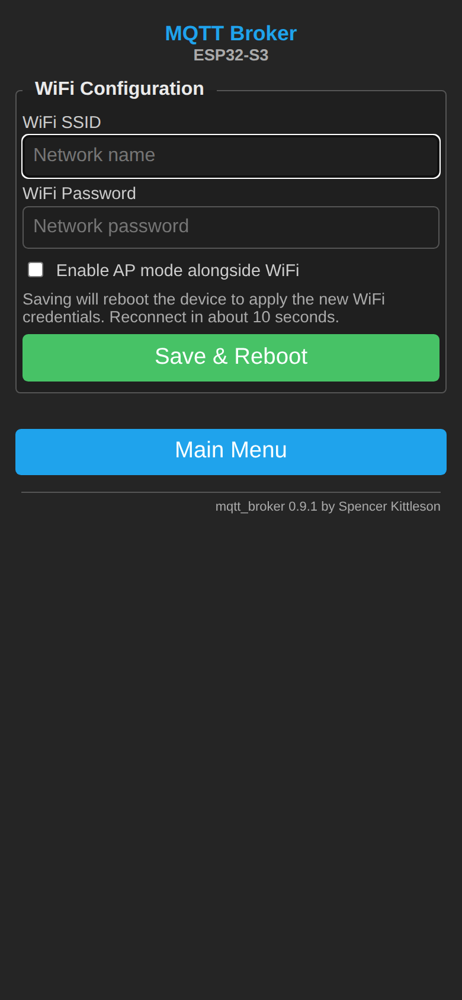
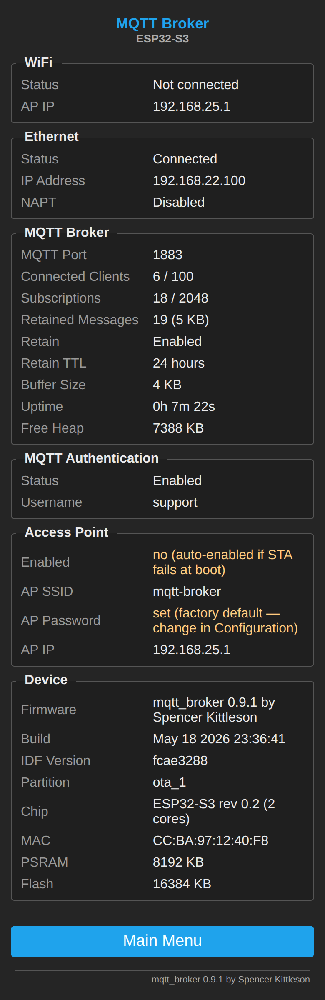

# Portal tour

A walk-through of the ESP32 MQTT broker's web portal as it ships in
**firmware v0.9.1**. Every screenshot below was captured live from a
Waveshare ESP32-S3-ETH on the lab network — no mockups, no Photoshop.

> Re-capture (after a UI change):
>
> ```bash
> PORTAL_URL=http://192.168.22.100 \
> PORTAL_AUTH=user:password \
> python3 tools/capture_portal.py
> python3 tools/capture_timers.py
> ```
>
> Outputs land in `docs/screenshots/ux-audit/` and `docs/screenshots/timers/`.

<p align="center">
  
</p>

---

## Dashboard — `/`

The landing page. WiFi / Ethernet status, broker counters, MQTT auth state,
firmware version, free heap.

| Desktop (1024 px) | Mobile (390 px) |
| --- | --- |
|  |  |

---

## Live clients — `/clients`

Polls `/api/clients` every 3 s. Shows MQTT clients (ID, IP, uptime, subs,
in-flight, published, keepalive) and WiFi AP clients (MAC, RSSI). Pause
button + tab-hidden backoff so a stale tab doesn't hammer the broker.

| Desktop | Mobile |
| --- | --- |
|  |  |

---

## Scheduled publishes — `/timers`

Tasmota-style timer slots (16 of them). Armed state shows as `●` / `◐` / `—`,
with a Repeat icon, time, day mask, and topic. The master pause pill in the
header disables the whole scheduler without losing per-slot config.

| List view | Edit (populated) |
| --- | --- |
|  |  |

The edit form has the full Tasmota field parity (Arm / Repeat / Time /
Window jitter / Days / Topic / Payload / QoS / Retain) plus a live
`Next fire: today at 17:00 (in 4h 12m)` line driven off the device's
local clock — DST handled by the POSIX TZ string set on `/settings`.

| Empty slot | Saved confirmation |
| --- | --- |
|  |  |

Mobile collapses to stacked cards under 600 px:

<p align="center">
  
  &nbsp;
  
</p>

---

## MQTT tester — `/tester`

A tiny in-portal MQTT client backed by a WebSocket. Subscribe to a topic,
watch messages stream in, publish back. Useful for verifying retained
messages and `$SYS/#` without having to fire up `mosquitto_sub`.

| Desktop | Mobile |
| --- | --- |
|  |  |

---

## Settings — `/settings`

Broker port, MQTT auth, retained-store TTL, AP credentials, hostname,
NAPT toggle, NTP upstreams, and the **timezone dropdown** (~40 IANA
presets plus a free-form POSIX TZ field). **Save & Reboot** runs through
a confirm dialog and a countdown page that polls `/api/ping` until the
device returns.

| Desktop | Mobile |
| --- | --- |
|  |  |

---

## WiFi config — `/config`

First-boot AP captive page. The same form is reachable post-provisioning
from the dashboard.

| Desktop | Mobile |
| --- | --- |
|  |  |

---

## Information — `/information`

Build metadata, partition table, NVS stats, Ethernet/WiFi link state, and
the `$SYS/broker/*` snapshot. The page admins land on when something is
acting weird.

| Desktop | Mobile |
| --- | --- |
|  |  |

---

## Firmware update — `/update`

File upload OR URL fetch. Dual OTA partitions with a manual rollback button
that shows the *other* partition's version, so you can flip back deliberately
rather than hoping the watchdog catches a bad image.

| Desktop | Mobile |
| --- | --- |
|  |  |

---

## See also

- [`api.md`](api.md) — full HTTP/JSON API reference (CSRF, auth, schemas)
- [`architecture.md`](architecture.md) — task layout, memory map, partitions
- [`timers-ux-audit-v0.8.0.md`](timers-ux-audit-v0.8.0.md) — the UX audit
  methodology these screenshots came out of
